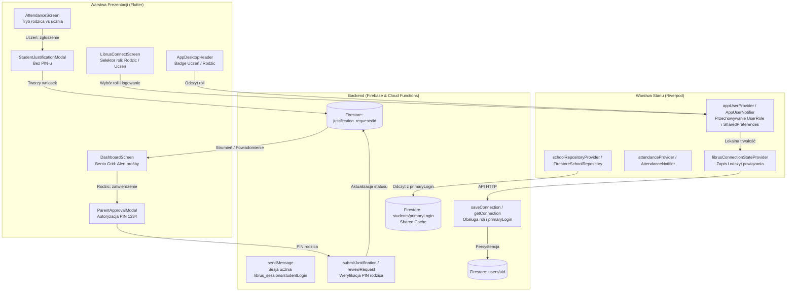

# Phase 14: Dostęp ucznia (rola student vs parent) i współdzielony cache danych — Pattern Map

**Phase:** 14 - dostep-ucznia-rola-student-vs-parent-i-wspoldzielony-cache-danych  
**Generated:** 2026-09-22  
**Status:** Complete  

---

## 1. Overview & Architecture Map

Faza 14 wdraża model wieloużytkownikowego dostępu rodzinnego w aplikacji EduSync:
- **Separacja tożsamości i ról:** `UserRole.parent` (Bartosz) vs `UserRole.student` (Oskar).
- **Bezpieczny obieg e-usprawiedliwień:** Uczeń zgłasza prośbę bez PIN-u -> prośba pojawia się u rodzica -> rodzic zatwierdza 4-cyfrowym PIN-em -> backend wysyła e-usprawiedliwienie do Librusa.
- **Single Source of Truth (Współdzielony cache):** Profil klasy i ucznia pobierany z `students/{primaryLogin}`, eliminując podwójny scraping Librusa.
- **Autentyczne wiadomości ucznia:** Wiadomości wysyłane z sesji `librus_sessions/{studentLogin}` (Oskar jako autor).



---

## 2. File Classifications & Analogs

### 2.1. Files to Create

| File | Role & Data Flow | Closest Analog | Analog File Path |
|---|---|---|---|
| `lib/domain/models/user_role.dart` | **Domain Model:** Definicja enumeratora `UserRole { parent, student }` z pomocniczymi getterami (`isParent`, `isStudent`, `displayName`) oraz parserem `fromString`. | `AttendanceType` / `JustificationStatus` | [`lib/domain/models/attendance_record.dart`](file:///Users/bjankiewicz/Projects/dziennik%20szkolny/lib/domain/models/attendance_record.dart#L1-L16) |
| `lib/domain/models/justification_request.dart` | **Domain Model:** Klasa reprezentująca wniosek ucznia o e-usprawiedliwienie (`JustificationRequest`), statusy (`JustificationRequestStatus`), serializacja JSON. | `LibrusQueryLog` / `AttendanceRecord` | [`lib/domain/models/librus_query_log.dart`](file:///Users/bjankiewicz/Projects/dziennik%20szkolny/lib/domain/models/librus_query_log.dart#L3-L90) |
| `lib/presentation/screens/attendance/widgets/student_justification_modal.dart` | **Presentation Component:** Modal dolny (bottom sheet) dla ucznia do zgłoszenia prośby o usprawiedliwienie rodzicowi — wybór szybkiego powodu, data, bez pola PIN. | `JustificationModal` | [`lib/presentation/screens/attendance/justification_modal.dart`](file:///Users/bjankiewicz/Projects/dziennik%20szkolny/lib/presentation/screens/attendance/justification_modal.dart#L5-L125) |
| `lib/presentation/screens/attendance/widgets/parent_approval_modal.dart` | **Presentation Component:** Modal dolny dla rodzica do autoryzacji wniosku nadesłanego przez ucznia kodem PIN (1234) i wysyłki do Librusa. | `JustificationModal` | [`lib/presentation/screens/attendance/justification_modal.dart`](file:///Users/bjankiewicz/Projects/dziennik%20szkolny/lib/presentation/screens/attendance/justification_modal.dart#L305-L390) |
| `functions/test/user_roles.test.js` | **Backend Test:** Testy jednostkowe endpointów `saveConnection` i `getConnection` dla ról `student` vs `parent` oraz separacji poświadczeń. | `librus_stealth.test.js` | [`functions/test/librus_stealth.test.js`](file:///Users/bjankiewicz/Projects/dziennik%20szkolny/functions/test/librus_stealth.test.js#L1-L50) |
| `functions/test/justification_requests.test.js` | **Backend Test:** Testy maszyny stanów wniosków o usprawiedliwienie (`pending_parent_approval` -> PIN rodzica -> `approved` / `rejected`). | `attendance_parsing.test.js` | [`functions/test/attendance_parsing.test.js`](file:///Users/bjankiewicz/Projects/dziennik%20szkolny/functions/test/attendance_parsing.test.js#L1-L60) |
| `functions/test/shared_cache.test.js` | **Backend Test:** Weryfikacja pobierania danych klasowych ze współdzielonego klucza `primaryLogin` bez zbędnego scrapingu serwerów Librus. | `librus_rate_limit.test.js` | [`functions/test/librus_rate_limit.test.js`](file:///Users/bjankiewicz/Projects/dziennik%20szkolny/functions/test/librus_rate_limit.test.js#L1-L45) |

---

### 2.2. Files to Modify

| File | Role & Data Flow | Closest Analog / Section | Analog File Path |
|---|---|---|---|
| `lib/presentation/providers/auth_providers.dart` | **State Management:** Rozszerzenie `AppUser` o pola `role`, `studentLogin`, `primaryLogin`, `familyId` oraz dodanie obsługi ról w `AppUserNotifier` i `SharedPreferences`. | `AppUserNotifier` | [`lib/presentation/providers/auth_providers.dart`](file:///Users/bjankiewicz/Projects/dziennik%20szkolny/lib/presentation/providers/auth_providers.dart#L11-L70) |
| `lib/data/services/librus_connection_service.dart` | **Data Service:** Rozszerzenie `isConnected()`, `connectWithCredentials()` i `disconnect()` o przekazywanie i zapis roli `role`, `studentLogin`, `primaryLogin`. | `isConnected()` & `connectWithCredentials()` | [`lib/data/services/librus_connection_service.dart`](file:///Users/bjankiewicz/Projects/dziennik%20szkolny/lib/data/services/librus_connection_service.dart#L33-L111) |
| `lib/data/repositories/firestore_school_repository.dart` | **Data Repository:** Aktualizacja `_getStudentData()` do pobierania `students/{primaryLogin}` dla obu ról (Single Source of Truth) oraz obsługa zapytań `justification_requests`. | `_getStudentData()` & `submitJustification()` | [`lib/data/repositories/firestore_school_repository.dart`](file:///Users/bjankiewicz/Projects/dziennik%20szkolny/lib/data/repositories/firestore_school_repository.dart#L82-L135) |
| `lib/presentation/screens/attendance/attendance_screen.dart` | **Presentation View:** Warunkowy UI w zależności od `UserRole`: dla ucznia przycisk „Poproś rodzica o usprawiedliwienie”, dla rodzica sekcja oczekujących wniosków z zatwierdzeniem PIN. | `_buildFloatingActionPanel()` & `_buildAttendanceItem()` | [`lib/presentation/screens/attendance/attendance_screen.dart`](file:///Users/bjankiewicz/Projects/dziennik%20szkolny/lib/presentation/screens/attendance/attendance_screen.dart#L905-L1055) |
| `lib/presentation/screens/attendance/justification_modal.dart` | **Presentation Component:** Dostosowanie istniejącego modalu PIN do zatwierdzania wniosków rodzica lub bezpośrednich zgłoszeń rodzica. | Główny build modalu | [`lib/presentation/screens/attendance/justification_modal.dart`](file:///Users/bjankiewicz/Projects/dziennik%20szkolny/lib/presentation/screens/attendance/justification_modal.dart#L305-L395) |
| `lib/presentation/screens/dashboard/dashboard_screen.dart` | **Presentation View:** Karta Bento Grid z powiadomieniem dla rodzica: *„Oskar prosi o usprawiedliwienie”* z akcjami `[Zatwierdź (PIN)]` i `[Odrzuć]`. Dla ucznia przekierowanie do `StudentJustificationModal`. | `_buildAttendanceWidget()` & skróty pulpitu | [`lib/presentation/screens/dashboard/dashboard_screen.dart`](file:///Users/bjankiewicz/Projects/dziennik%20szkolny/lib/presentation/screens/dashboard/dashboard_screen.dart#L1660-L1785) |
| `lib/presentation/widgets/app_desktop_header.dart` | **Presentation Component:** Wyświetlanie dedykowanego badge'a roli: fioletowy `🎓 Uczeń` (`AppColors.secondaryContainer`) lub szary/teal `Rodzic` obok profilu. | `Student Profile Chip` | [`lib/presentation/widgets/app_desktop_header.dart`](file:///Users/bjankiewicz/Projects/dziennik%20szkolny/lib/presentation/widgets/app_desktop_header.dart#L143-L195) |
| `lib/presentation/screens/main_navigation_screen.dart` | **Presentation Shell:** Prezentacja roli w `_showProfileSheet` oraz obsługa przełączania i odświeżania sesji. | `_showProfileSheet()` | [`lib/presentation/screens/main_navigation_screen.dart`](file:///Users/bjankiewicz/Projects/dziennik%20szkolny/lib/presentation/screens/main_navigation_screen.dart#L200-L260) |
| `lib/presentation/screens/auth/librus_connect_screen.dart` | **Presentation View:** Dodanie komponentu `SegmentedButton<UserRole>` z wyborem konta Rodzica vs konta Ucznia (Oskar) i odpowiednimi opisami uprawnień. | `_handleConnect()` & formularz logowania | [`lib/presentation/screens/auth/librus_connect_screen.dart`](file:///Users/bjankiewicz/Projects/dziennik%20szkolny/lib/presentation/screens/auth/librus_connect_screen.dart#L27-L63) |
| `functions/index.js` | **Backend API:** Obsługa `role`, `studentLogin`, `primaryLogin`, `familyId` w `saveConnection`/`getConnection`, obsługa sesji ucznia w `sendMessage` oraz obsługa wniosków o usprawiedliwienie. | `saveConnection`, `getConnection`, `sendMessage` | [`functions/index.js`](file:///Users/bjankiewicz/Projects/dziennik%20szkolny/functions/index.js#L85-L167) |
| `functions/src/sync_service.js` | **Backend Service:** Utrzymywanie współdzielonego cache'u w dokumencie `students/{primaryLogin}` bez duplikowania scrapingu dla kont ucznia. | `syncStudentData()` | [`functions/src/sync_service.js`](file:///Users/bjankiewicz/Projects/dziennik%20szkolny/functions/src/sync_service.js#L30-L80) |

---

## 3. Concrete Code Excerpts & Patterns

### 3.1. Pattern: Enumerator i Model Roli Użytkownika

**Existing Analog:** [`lib/domain/models/attendance_record.dart`](file:///Users/bjankiewicz/Projects/dziennik%20szkolny/lib/domain/models/attendance_record.dart#L1-L16)
```dart
enum AttendanceType {
  present,
  absent,
  excused,
  late,
  excusedLate,
  exempted,
}

enum JustificationStatus {
  none,
  requested,
  approved,
  rejected,
}
```

**Implementation Pattern for `lib/domain/models/user_role.dart`:**
```dart
enum UserRole {
  parent,
  student;

  bool get isParent => this == UserRole.parent;
  bool get isStudent => this == UserRole.student;

  String get displayName => switch (this) {
    UserRole.parent => 'Rodzic',
    UserRole.student => 'Uczeń',
  };

  static UserRole fromString(String? role) {
    if (role?.toLowerCase() == 'student') return UserRole.student;
    return UserRole.parent;
  }
}
```

---

### 3.2. Pattern: Model AppUser i trwałość w SharedPreferences

**Existing Analog:** [`lib/presentation/providers/auth_providers.dart`](file:///Users/bjankiewicz/Projects/dziennik%20szkolny/lib/presentation/providers/auth_providers.dart#L11-L68)
```dart
class AppUser {
  final String displayName;
  final String email;
  final String? photoUrl;

  const AppUser({
    required this.displayName,
    required this.email,
    this.photoUrl,
  });
}

class AppUserNotifier extends Notifier<AppUser?> {
  static const _keyEmail = 'app_user_email';
  static const _keyName = 'app_user_name';
  static const _keyPhoto = 'app_user_photo';
  static const _keyIsLoggedIn = 'app_user_is_logged_in';
...
```

**Implementation Pattern for Phase 14 (`auth_providers.dart`):**
```dart
import '../../domain/models/user_role.dart';

class AppUser {
  final String displayName;
  final String email;
  final String? photoUrl;
  final UserRole role;
  final String? studentLogin;
  final String? primaryLogin;
  final String? familyId;

  const AppUser({
    required this.displayName,
    required this.email,
    this.photoUrl,
    this.role = UserRole.parent,
    this.studentLogin,
    this.primaryLogin,
    this.familyId,
  });

  bool get isParent => role.isParent;
  bool get isStudent => role.isStudent;
}

class AppUserNotifier extends Notifier<AppUser?> {
  static const _keyEmail = 'app_user_email';
  static const _keyName = 'app_user_name';
  static const _keyPhoto = 'app_user_photo';
  static const _keyIsLoggedIn = 'app_user_is_logged_in';
  static const _keyRole = 'app_user_role';
  static const _keyStudentLogin = 'app_user_student_login';
  static const _keyPrimaryLogin = 'app_user_primary_login';
  static const _keyFamilyId = 'app_user_family_id';
...
```

---

### 3.3. Pattern: Model Wniosku o Usprawiedliwienie (`JustificationRequest`)

**Existing Analog:** [`lib/domain/models/librus_query_log.dart`](file:///Users/bjankiewicz/Projects/dziennik%20szkolny/lib/domain/models/librus_query_log.dart#L3-L45)
```dart
class LibrusQueryLog {
  final String id;
  final String url;
  ...
  factory LibrusQueryLog.fromJson(Map<String, dynamic> json, {String? id}) { ... }
}
```

**Implementation Pattern for `lib/domain/models/justification_request.dart`:**
```dart
enum JustificationRequestStatus {
  pendingParentApproval,
  approved,
  rejected;

  static JustificationRequestStatus fromString(String? status) {
    return switch (status) {
      'approved' => JustificationRequestStatus.approved,
      'rejected' => JustificationRequestStatus.rejected,
      _ => JustificationRequestStatus.pendingParentApproval,
    };
  }

  String toFirestore() {
    return switch (this) {
      JustificationRequestStatus.approved => 'approved',
      JustificationRequestStatus.rejected => 'rejected',
      JustificationRequestStatus.pendingParentApproval => 'pending_parent_approval',
    };
  }
}

class JustificationRequest {
  final String id;
  final String studentLogin;
  final String studentName;
  final String? familyId;
  final String primaryLogin;
  final List<String> recordIds;
  final List<int> lessonNumbers;
  final List<String> subjectNames;
  final DateTime date;
  final String reason;
  final JustificationRequestStatus status;
  final DateTime requestedAt;
  final DateTime? reviewedAt;
  final String? reviewedBy;
  final String? rejectionReason;

  const JustificationRequest({
    required this.id,
    required this.studentLogin,
    required this.studentName,
    this.familyId,
    required this.primaryLogin,
    required this.recordIds,
    required this.lessonNumbers,
    required this.subjectNames,
    required this.date,
    required this.reason,
    required this.status,
    required this.requestedAt,
    this.reviewedAt,
    this.reviewedBy,
    this.rejectionReason,
  });

  factory JustificationRequest.fromJson(Map<String, dynamic> json, {String? id}) {
    return JustificationRequest(
      id: id ?? json['id'] as String? ?? '',
      studentLogin: json['studentLogin'] as String? ?? '',
      studentName: json['studentName'] as String? ?? 'Oskar Jankiewicz',
      familyId: json['familyId'] as String?,
      primaryLogin: json['primaryLogin'] as String? ?? '',
      recordIds: (json['recordIds'] as List<dynamic>?)?.map((e) => e.toString()).toList() ?? [],
      lessonNumbers: (json['lessonNumbers'] as List<dynamic>?)?.map((e) => (e as num).toInt()).toList() ?? [],
      subjectNames: (json['subjectNames'] as List<dynamic>?)?.map((e) => e.toString()).toList() ?? [],
      date: json['date'] != null ? DateTime.parse(json['date'] as String) : DateTime.now(),
      reason: json['reason'] as String? ?? 'Wizyta lekarska',
      status: JustificationRequestStatus.fromString(json['status'] as String?),
      requestedAt: json['requestedAt'] != null ? DateTime.parse(json['requestedAt'] as String) : DateTime.now(),
      reviewedAt: json['reviewedAt'] != null ? DateTime.tryParse(json['reviewedAt'] as String) : null,
      reviewedBy: json['reviewedBy'] as String?,
      rejectionReason: json['rejectionReason'] as String?,
    );
  }

  Map<String, dynamic> toJson() {
    return {
      'id': id,
      'studentLogin': studentLogin,
      'studentName': studentName,
      'familyId': familyId,
      'primaryLogin': primaryLogin,
      'recordIds': recordIds,
      'lessonNumbers': lessonNumbers,
      'subjectNames': subjectNames,
      'date': date.toIso8601String().substring(0, 10),
      'reason': reason,
      'status': status.toFirestore(),
      'requestedAt': requestedAt.toIso8601String(),
      'reviewedAt': reviewedAt?.toIso8601String(),
      'reviewedBy': reviewedBy,
      'rejectionReason': rejectionReason,
    };
  }
}
```

---

### 3.4. Pattern: UI Ucznia we Frekwencji (Brak PIN-u, D-03)

**Existing Analog:** [`lib/presentation/screens/attendance/attendance_screen.dart`](file:///Users/bjankiewicz/Projects/dziennik%20szkolny/lib/presentation/screens/attendance/attendance_screen.dart#L987-L1055)
```dart
// Dotychczasowy kod: bezwarunkowy JustificationModal z kodem PIN
JustificationModal.show(
  context,
  _selectedIds.toList(),
  _selectedQuickReason,
  (reason, pin, selectedDate) async {
    ...
  },
);
```

**Implementation Pattern for Phase 14 (`AttendanceScreen`):**
```dart
final appUser = ref.watch(appUserProvider);
final isStudent = appUser?.isStudent ?? false;

if (isStudent) {
  // Otwórz dedykowany modal ucznia bez pola PIN
  StudentJustificationModal.show(
    context,
    _selectedIds.toList(),
    _selectedQuickReason,
    (reason, selectedDate) async {
      await ref.read(attendanceProvider.notifier).requestJustification(
            _selectedIds.toList(),
            reason,
            date: selectedDate,
          );
      setState(() => _selectedIds.clear());
      if (context.mounted) {
        ScaffoldMessenger.of(context).showSnackBar(
          const SnackBar(
            content: Text('Wysłano prośbę o usprawiedliwienie do rodzica.'),
            backgroundColor: Color(0xFFD97706), // Amber
          ),
        );
      }
    },
  );
} else {
  // Tryb rodzica: Standardowy JustificationModal z PIN-em
  JustificationModal.show(
    context,
    _selectedIds.toList(),
    _selectedQuickReason,
    (reason, pin, selectedDate) async {
      ...
    },
  );
}
```

---

### 3.5. Pattern: Badge roli w nagłówku aplikacji

**Existing Analog:** [`lib/presentation/widgets/app_desktop_header.dart`](file:///Users/bjankiewicz/Projects/dziennik%20szkolny/lib/presentation/widgets/app_desktop_header.dart#L150-L170)
```dart
Column(
  mainAxisAlignment: MainAxisAlignment.center,
  crossAxisAlignment: CrossAxisAlignment.end,
  children: [
    Text(
      student?.name ?? "Uczeń",
      style: Theme.of(context).textTheme.labelLarge?.copyWith(...),
    ),
    Text(
      student?.className ?? "Klasa 4 k Lic",
      style: Theme.of(context).textTheme.bodySmall?.copyWith(...),
    ),
  ],
)
```

**Implementation Pattern for Phase 14 (`AppDesktopHeader`):**
```dart
// Dodanie badge'a roli (Uczeń vs Rodzic)
final role = appUser?.role ?? UserRole.parent;
final isStudent = role.isStudent;

Container(
  padding: const EdgeInsets.symmetric(horizontal: 8, vertical: 3),
  decoration: BoxDecoration(
    color: isStudent ? const Color(0xFFEEF2FF) : const Color(0xFFF1F5F9),
    borderRadius: BorderRadius.circular(12),
    border: Border.all(
      color: isStudent ? const Color(0xFFC7D2FE) : const Color(0xFFE2E8F0),
      width: 1,
    ),
  ),
  child: Row(
    mainAxisSize: MainAxisSize.min,
    children: [
      Icon(
        isStudent ? Icons.school_rounded : Icons.family_restroom_rounded,
        size: 13,
        color: isStudent ? const Color(0xFF3525CD) : const Color(0xFF475569),
      ),
      const SizedBox(width: 4),
      Text(
        role.displayName,
        style: TextStyle(
          fontSize: 11,
          fontWeight: FontWeight.w700,
          color: isStudent ? const Color(0xFF3525CD) : const Color(0xFF475569),
        ),
      ),
    ],
  ),
)
```

---

### 3.6. Pattern: Współdzielony Cache w FirestoreSchoolRepository (D-05)

**Existing Analog:** [`lib/data/repositories/firestore_school_repository.dart`](file:///Users/bjankiewicz/Projects/dziennik%20szkolny/lib/data/repositories/firestore_school_repository.dart#L86-L95)
```dart
final connectedLogin = await _connectionService.getConnectedLogin();
final queryStr = (connectedLogin != null && connectedLogin.isNotEmpty)
    ? '?login=$connectedLogin'
    : '';
```

**Implementation Pattern for Phase 14 (`FirestoreSchoolRepository`):**
```dart
// Sprawdź czy użytkownik to uczeń — jeśli tak, dane klasowe pobieraj z primaryLogin rodzica
final appUser = await _connectionService.getSavedAppUser();
final targetLogin = (appUser?.isStudent == true && appUser?.primaryLogin != null)
    ? appUser!.primaryLogin!
    : (await _connectionService.getConnectedLogin() ?? '');

final queryStr = targetLogin.isNotEmpty ? '?login=$targetLogin' : '';

// Cloud Firestore SDK:
if (targetLogin.isNotEmpty) {
  try {
    final doc = await _firestore.collection('students').doc(targetLogin).get();
    if (doc.exists && doc.data() != null) {
      final data = doc.data()!;
      _memoryCache = data;
      _lastCacheTime = DateTime.now();
      return data;
    }
  } catch (_) {}
}
```

---

### 3.7. Pattern: Backend Cloud Functions (Node.js) dla ról i zapytań

**Existing Analog:** [`functions/index.js`](file:///Users/bjankiewicz/Projects/dziennik%20szkolny/functions/index.js#L110-L122)
```javascript
const login = req.query.login || req.body?.login || process.env.LIBRUS_LOGIN || "";
const email = req.query.email || req.body?.email || "";

await admin.firestore().collection("users").doc(userId).set({
  userId,
  email,
  connected: true,
  librusLogin: login,
  isDemoMode: false,
  updatedAt: admin.firestore.FieldValue.serverTimestamp()
}, { merge: true });
```

**Implementation Pattern for Phase 14 (`functions/index.js`):**
```javascript
const login = req.query.login || req.body?.login || process.env.LIBRUS_LOGIN || "";
const email = req.query.email || req.body?.email || "";
const role = req.query.role || req.body?.role || "parent";
const studentLogin = req.query.studentLogin || req.body?.studentLogin || "";
const primaryLogin = req.query.primaryLogin || req.body?.primaryLogin || "";
const familyId = req.query.familyId || req.body?.familyId || "";

await admin.firestore().collection("users").doc(userId).set({
  userId,
  email,
  role,
  studentLogin: studentLogin || (role === "student" ? login : null),
  primaryLogin: primaryLogin || (role === "parent" ? login : null),
  familyId: familyId || "jankiewicz_family",
  connected: true,
  librusLogin: login,
  isDemoMode: false,
  updatedAt: admin.firestore.FieldValue.serverTimestamp()
}, { merge: true });
```

---

### 3.8. Pattern: Node.js Unit Testing

**Existing Analog:** [`functions/test/attendance_parsing.test.js`](file:///Users/bjankiewicz/Projects/dziennik%20szkolny/functions/test/attendance_parsing.test.js#L1-L20)
```javascript
const { describe, it } = require("node:test");
const assert = require("node:assert");

describe("Attendance Parsing & Reconciliation", () => {
  it("should correctly classify...", () => {
    assert.strictEqual(...);
  });
});
```

**Implementation Pattern for `functions/test/user_roles.test.js`:**
```javascript
const { describe, it } = require("node:test");
const assert = require("node:assert");

describe("User Roles & Permissions", () => {
  it("should parse student role correctly and identify restriction", () => {
    const role = "student";
    const canSubmitDirectJustification = role !== "student";
    assert.strictEqual(canSubmitDirectJustification, false);
  });

  it("should allow parent to submit justification with valid 4-digit PIN", () => {
    const role = "parent";
    const pin = "1234";
    const isValidPin = /^\d{4}$/.test(pin) && pin === "1234";
    assert.strictEqual(role === "parent" && isValidPin, true);
  });
});
```

---

## 4. Summary & Implementation Guidance

1. **Brak duplikacji logiki:** Wszystkie modele i komponenty ściśle rozwijają istniejące wzorce projektowe (`AsyncNotifier`, `JustificationModal`, `LibrusClient`).
2. **Architektura Single Source of Truth:** `students/{primaryLogin}` pozostaje jedynym źródłem prawdy dla planu lekcji i ocen.
3. **Stabilność typów:** Nowe enumeratory (`UserRole`, `JustificationRequestStatus`) posiadają bezpieczne fallbacki tekstowe, uniemożliwiające błędy parsowania przy starszych dokumentach Firestore.
4. **Weryfikacja natychmiastowa:** Testy backendowe w `functions/test/` wykonują się w ~200ms przez `node --test`, a kod Fluttera jest weryfikowany przez `flutter analyze`.

## PATTERN MAPPING COMPLETE.
