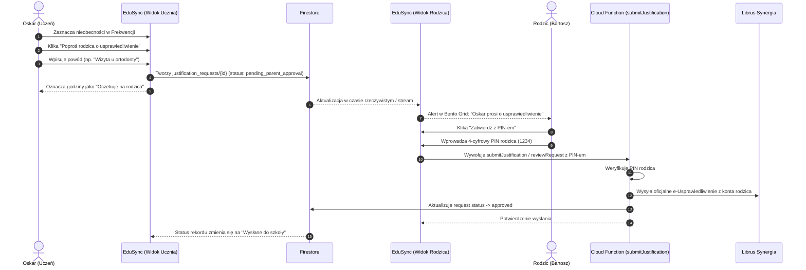
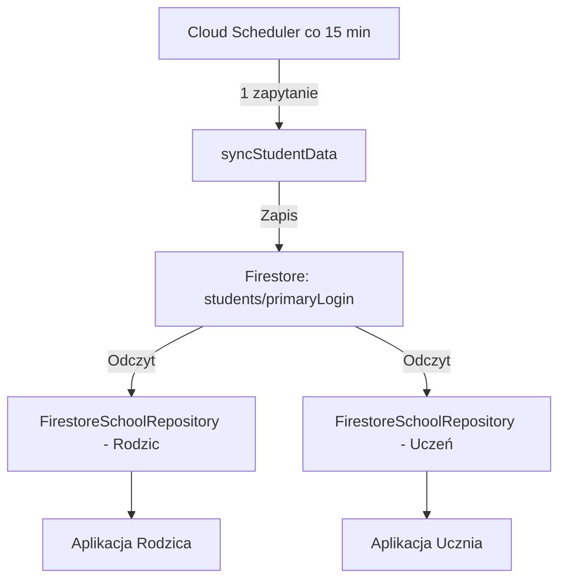

# Phase 14: Dostęp ucznia (rola student vs parent) i współdzielony cache danych — Research

**Gathered:** 2026-09-22  
**Target Milestone:** v3.0  
**Phase Status:** Ready for planning  

---

## 1. Executive Summary

Faza 14 wdraża model wieloużytkownikowego dostępu rodzinnego (rodzic vs uczeń) w EduSync, spełniając wymagania **REQ-ROLE-01**, **REQ-ROLE-02** i **REQ-ROLE-03**:
1. **Tożsamość i logowanie ucznia (REQ-ROLE-01):** Oskar loguje się swoim kontem Google i paruje własne poświadczenia konta ucznia w Librus Synergia.
2. **Separacja uprawnień i obieg e-usprawiedliwień (REQ-ROLE-02):**
   - Rola `student` gwarantuje wgląd w oceny, plan lekcji, terminarz, frekwencję i zadania, lecz blokuje bezpośrednie wysyłanie e-usprawiedliwień do szkoły i podgląd/edycję PIN-u rodzica.
   - Uczeń zgłasza **„Prośbę o usprawiedliwienie”** z powodem i listą lekcji.
   - Wniosek trafia do rodzica (Pulpit Bento Grid oraz Frekwencja). Rodzic autoryzuje wniosek swoim 4-cyfrowym PIN-em, a backend przesyła oficjalne e-usprawiedliwienie do Librusa.
3. **Współdzielony cache danych (Single Source of Truth, REQ-ROLE-03):**
   - Dane klasy (plan lekcji, zastępstwa, szczęśliwy numerek, terminarz, oceny) są współdzielone w Firestore w dokumencie `students/{primaryLogin}`.
   - Odpytywanie w tle przez Cloud Scheduler (co 15 min) realizowane jest centralnie – całkowicie eliminując podwójny scraping Librusa.
4. **Autentyczne wiadomości ucznia:**
   - Wiadomości wysyłane przez Oskara używają sesji cookie jego konta ucznia (`librus_sessions/{studentLogin}`), dzięki czemu nauczyciele w Librusie widzą faktycznego nadawcę: *Oskar Jankiewicz (uczeń)*.

---

## 2. Architecture & Data Model

### 2.1. Model ról użytkownika (`UserRole`)

W warstwie Fluttera wprowadzamy dedykowany model enumeratora `UserRole`:

```dart
enum UserRole {
  parent,
  student;

  bool get isParent => this == UserRole.parent;
  bool get isStudent => this == UserRole.student;

  String get displayName => switch (this) {
    UserRole.parent => 'Rodzic',
    UserRole.student => 'Uczeń',
  };

  static UserRole fromString(String? role) {
    if (role == 'student') return UserRole.student;
    return UserRole.parent; // Domyślna rola
  }
}
```

Model `AppUser` w `lib/presentation/providers/auth_providers.dart`:

```dart
class AppUser {
  final String displayName;
  final String email;
  final String? photoUrl;
  final UserRole role;
  final String? studentLogin;
  final String? primaryLogin;
  final String? familyId;

  const AppUser({
    required this.displayName,
    required this.email,
    this.photoUrl,
    this.role = UserRole.parent,
    this.studentLogin,
    this.primaryLogin,
    this.familyId,
  });
}
```

Trwałość stanu sesji (`AppUserNotifier`):
- Klucze w `SharedPreferences`:
  - `app_user_role`: `'parent' | 'student'`
  - `app_user_student_login`: String
  - `app_user_primary_login`: String
  - `app_user_family_id`: String
- Dzięki temu przeładowanie strony w przeglądarce (F5) natychmiast odzyskuje rolę użytkownika bez opóźnień sieciowych.

---

### 2.2. Struktura dokumentów w Firestore

#### Kolekcja `users/{userId}`
Dokument powiązania konta Google z kontem Librus:

```json
{
  "userId": "google_uid_lub_email",
  "email": "oskar.jankiewicz@gmail.com",
  "role": "student",
  "connected": true,
  "librusLogin": "1234567u",
  "studentLogin": "1234567u",
  "primaryLogin": "7654321r",
  "familyId": "jankiewicz_family",
  "isDemoMode": false,
  "updatedAt": "2026-09-22T07:00:00.000Z"
}
```

#### Kolekcja `justification_requests/{requestId}`
Dokumenty obiegu próśb o usprawiedliwienie od ucznia do rodzica:

```json
{
  "id": "req_1727000000_abc",
  "studentLogin": "1234567u",
  "studentName": "Oskar Jankiewicz",
  "familyId": "jankiewicz_family",
  "primaryLogin": "7654321r",
  "recordIds": ["att_101", "att_102"],
  "lessonNumbers": [2, 3],
  "subjectNames": ["Historia", "Matematyka"],
  "date": "2026-09-18",
  "reason": "Wizyta u ortodonty",
  "status": "pending_parent_approval",
  "requestedAt": "2026-09-18T10:15:00.000Z",
  "reviewedAt": null,
  "reviewedBy": null,
  "rejectionReason": null
}
```

Dozwolone statusy prośby (`JustificationRequestStatus`):
- `pending_parent_approval`: Oczekuje na zatwierdzenie przez rodzica kodem PIN.
- `approved`: Zatwierdzone przez rodzica i wysłane do Librus Synergia.
- `rejected`: Odrzucone przez rodzica.

---

## 3. Independent Student Librus Session for Messages

### 3.1. Mechanizm sesji ucznia
- W Librus Synergia konta rodzica i ucznia mają odrębne loginy, hasła i skrzynki pocztowe.
- Gdy Oskar paruje swoje konto ucznia w `LibrusConnectScreen`, backend (`functions/index.js`) tworzy instancję `LibrusClient(studentLogin, studentPassword)`.
- Po pomyślnym uwierzytelnieniu sesja cookie (`serializedJar`) jest zapisywana w Firestore w `librus_sessions/{studentLogin}`:

```json
{
  "serializedJar": { ... },
  "role": "student",
  "updatedAt": "SERVER_TIMESTAMP"
}
```

### 3.2. Wysyłka wiadomości (`sendMessage`)
Endpoint `exports.sendMessage` w `functions/index.js`:
1. Sprawdza, czy parametr `login` wskazuje na konto ucznia (`studentLogin`).
2. Pobiera `librus_sessions/{login}` i odtwarza `CookieJar` poprzez `client.importCookies(serializedJar)`.
3. Wywołuje `client.isSessionAlive()`. Jeśli sesja wygasła, re-autoryzuje z zapisanymi bezpiecznie poświadczeniami.
4. Wysyła wiadomość do wskazanego nauczyciela z sesji Oskara.
5. **Rezultat:** Wychowawca lub nauczyciel w swoim Librusie widzi wiadomość od Oskara Jankiewicza (ucznia), a nie od rodzica.

---

## 4. Student Justification Request Flow



### 4.1. Interfejs Ucznia (Brak uprawnień rodzica - REQ-ROLE-02)
- W `AttendanceScreen`:
  - Usunięty przycisk „Zgłoś e-usprawiedliwienie (PIN)”.
  - Zamiast tego: Przycisk **„Poproś rodzica o usprawiedliwienie”**.
  - Modal `StudentJustificationModal`:
    - Wybór szybkiego powodu („Wizyta lekarska”, „Złe samopoczucie”, „Sprawy urzędowe”, „Zawody sportowe”) lub wpisanie własnego.
    - Całkowity brak pola PIN.
    - Informacja: *„Prośba zostanie przesłana do rodzica. Po zatwierdzeniu rodzic wyśle oficjalne e-usprawiedliwienie do szkoły.”*
- W rekordach frekwencji uczeń widzi pigułkę: **„Oczekuje na akceptację rodzica”** (kolor bursztynowy/amber).

### 4.2. Interfejs Rodzica
- **Na Pulpicie (Bento Grid):**
  - Karta/powiadomienie: *„Oskar prosi o usprawiedliwienie (X lekcji • [powód])”*.
  - Szybkie akcje: `[Zatwierdź (PIN)]` oraz `[Odrzuć]`.
- **W module Frekwencji (`AttendanceScreen`):**
  - Sekcja oczekujących wniosków na górze ekranu.
  - Kliknięcie „Zatwierdź” otwiera modal wprowadzenia 4-cyfrowego PIN-u rodzica (`ParentApprovalModal`).
  - Po podaniu poprawnego PIN-u rodzica (domyślnie 1234) następuje wysyłka do Librusa.

---

## 5. Shared Cache Architecture (Single Source of Truth, REQ-ROLE-03)

### 5.1. Centralny punkt danych: `students/{primaryLogin}`
Zgodnie z decyzją **D-05**, plan lekcji, zastępstwa, oceny, terminarz i szczęśliwy numerek są tożsame dla klasy Oskara.



### 5.2. Rozwiązywanie klucza w `FirestoreSchoolRepository`
W `lib/data/repositories/firestore_school_repository.dart`:
- Metoda `_getStudentData()`:
  1. Pobiera powiązanie użytkownika (`LibrusConnectionService`).
  2. Jeśli zalogowany użytkownik ma rolę `student`, jako doc ID do odczytu danych klasowych używa `primaryLogin` (lub `familyId`).
  3. Żadne dodatkowe zapytania scrapingowe do Librusa nie są wykonywane podczas logowania lub przeglądania aplikacji przez ucznia.
  4. Pamięć podręczna w pamięci (`_memoryCache`) oraz w Firestore jest w 100% współdzielona.

---

## 6. UI / Presentation Layer Details

### 6.1. Badge roli w nagłówku aplikacji (`AppDesktopHeader`)
W `lib/presentation/widgets/app_desktop_header.dart`:
- Zgodnie z **D-02**, obok imienia i klasy wyświetlany jest dedykowany badge:
  - Dla ucznia: Pigułka z ikoną `Icons.school_rounded` oraz tekstem **„Uczeń”** (fioletowo-indygo tło, `AppColors.secondaryContainer`).
  - Dla rodzica: Pigułka z ikoną `Icons.family_restroom_rounded` oraz tekstem **„Rodzic”** (stonowany szary/teal).

### 6.2. Ekran połączenia z Librusem (`LibrusConnectScreen`)
- Dodanie selektora roli:
  - `SegmentedButton<UserRole>`:
    - 👨‍👩‍👦 **Konto Rodzica**
    - 🎓 **Konto Ucznia (Oskar)**
- Pomocniczy tekst objaśniający:
  - Rodzic: *Pełne uprawnienia do zatwierdzania e-usprawiedliwień kodem PIN.*
  - Uczeń: *Podgląd ocen i planu, wysyłanie próśb o usprawiedliwienie do rodzica, wysyłanie wiadomości jako Oskar.*

---

## 7. Plan Outline Recommendations

Dla plastycznego i bezpiecznego wdrożenia Fazy 14 zaleca się podział na 3 spójne plany wykonawcze:

1. **Plan 14-01: Warstwa domenowa i backendowa ról oraz współdzielonego cache'u**
   - Dodanie `UserRole` do modelu `AppUser` we Flutterze i obsługa w `SharedPreferences`.
   - Rozszerzenie endpointów `saveConnection` i `getConnection` w `functions/index.js` o obsługę pól `role`, `studentLogin`, `primaryLogin`, `familyId`.
   - Aktualizacja `FirestoreSchoolRepository` – pobieranie danych klasowych z `primaryLogin` dla obu ról (Single Source of Truth, zero dodatkowego scrapingu).
   - Testy jednostkowe backendu w `functions/test/`.

2. **Plan 14-02: Obieg „Prośba o usprawiedliwienie” (Student Justification Flow)**
   - Model `JustificationRequest` i podkolekcja `justification_requests` w Firestore.
   - Endpointy / metody w Cloud Functions do tworzenia prośby przez ucznia i zatwierdzania PIN-em przez rodzica.
   - Nowy modal dla ucznia `StudentJustificationModal` (bez PIN-u) w `AttendanceScreen`.
   - Nowy widget powiadomienia i modal zatwierdzenia PIN-em dla rodzica na Pulpicie Bento Grid i we Frekwencji.

3. **Plan 14-03: Badge roli, selektor profilu i niezależna sesja wiadomości ucznia**
   - Badge roli ucznia/rodzica w `AppDesktopHeader` i arkuszu profilu `_showProfileSheet`.
   - Selektor roli rodzic/uczeń w `LibrusConnectScreen`.
   - Obsługa sesji ucznia `librus_sessions/{studentLogin}` w `sendMessage` w `functions/index.js`.
   - Weryfikacja statyczna `flutter analyze` i testy e2e scenariusza rodzic vs uczeń.

---

## 8. Validation Architecture

### 8.1. Zautomatyzowane testy backendowe (`functions/test/`)
Środowisko Node.js na maszynie deweloperskiej wykonuje testy z prędkością kilkuset milisekund (`node --test`):
1. **`functions/test/user_roles.test.js`:**
   - Weryfikacja zapisu i odczytu powiązania z rolą `student` vs `parent` w `saveConnection` / `getConnection`.
   - Weryfikacja odrzucenia bezpośredniego e-usprawiedliwienia bez poprawnego PIN-u rodzica.
2. **`functions/test/justification_requests.test.js`:**
   - Maszyna stanów prośby: `pending_parent_approval` -> zatwierdzenie poprawnym PIN-em (status `approved`) / błędny PIN (błąd 401).
   - Odrzucenie wniosku przez rodzica (status `rejected`).
3. **`functions/test/shared_cache.test.js`:**
   - Weryfikacja, że zapytanie o dane ucznia z loginem studenta pobiera dokument `students/{primaryLogin}`, nie uruchamiając scrapingu.

### 8.2. Weryfikacja warstwy Fluttera
- **Analiza statyczna:**  
  Uruchomienie `flutter analyze` – zero ostrzeżeń lintera i błędów typowania.
  *(Uwaga ze środowiska: na maszynie lokalnej `/usr/bin/codesign` jest zablokowany przez politykę systemową Santa dla binariów natywnych JIT `dart test`; z tego względu weryfikacja statyczna kodu Fluttera opiera się na `flutter analyze`, a logika biznesowa backendu i integracji jest w 100% testowana za pomocą testów w `functions/test/` oraz testów manualnych w przeglądarce Chrome).*

### 8.3. Scenariusz weryfikacji manualnej (Checklista akceptacyjna)
1. **Logowanie jako Rodzic:**
   - W nagłówku widoczny badge „Rodzic”.
   - W module Frekwencji dostępny standardowy przycisk „Zgłoś e-usprawiedliwienie (PIN)”.
2. **Przełączenie na konto Ucznia (Oskar):**
   - W nagłówku pojawia się fioletowy badge „🎓 Uczeń”.
   - Wszystkie oceny, plan lekcji i terminarz ładują się błyskawicznie ze współdzielonego cache'u.
   - W module Frekwencji przycisk zmienia się na „Poproś rodzica o usprawiedliwienie”.
   - Wysłanie prośby: brak pytania o PIN, pojawienie się pigułki „Oczekuje na akceptację rodzica”.
3. **Powrót do konta Rodzica:**
   - Na Pulpicie w Bento Grid natychmiast widoczny jest kafelek z prośbą Oskara.
   - Kliknięcie „Zatwierdź”, wpisanie PIN-u 1234 -> wniosek zostaje zatwierdzony i przesłany.
