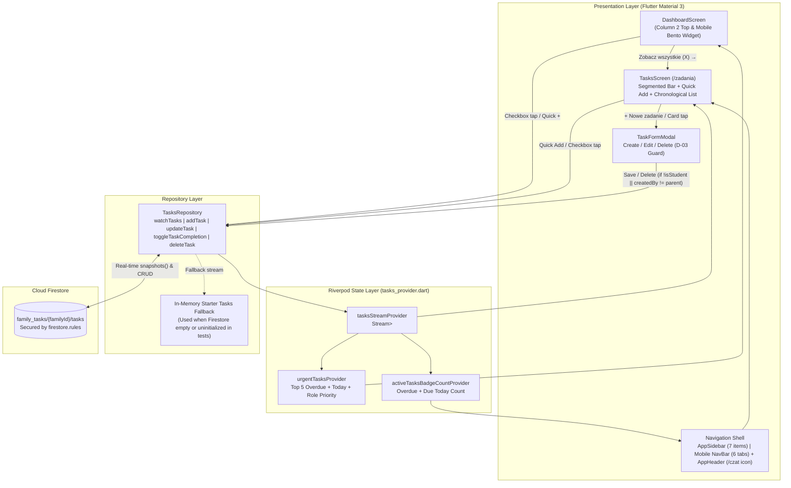

# Phase 15: Moduł zadań (Smart To-Do) i widżet na Pulpicie - Research

**Researched:** 2026-09-23
**Domain:** Real-time Family Smart To-Do (`SchoolTask`), Firestore (`family_tasks/{familyId}/tasks`), Riverpod `StreamProvider`, `go_router` Shell Navigation (`/zadania` & `/czat`), and Responsive Bento Grid Dashboard Widget (`DashboardScreen`)
**Confidence:** HIGH

<user_constraints>
## User Constraints (from CONTEXT.md)

### Locked Decisions

#### 1. Model zadań i współpraca Rodzic ↔ Uczeń (D-01, D-02, D-03)
- **D-01 (Przypisanie i atrybucja na wspólnej liście):**
  - Zadania są przechowywane we wspólnej kolekcji rodzinnej w Firestore (np. `family_tasks/{familyId}/tasks`, analogicznie do `family_chats/{familyId}/messages`) synchronizowanej w czasie rzeczywistym przez Riverpod `StreamProvider`.
  - Każde zadanie posiada przypisanie odbiorcy (`assignedTo`: `student` — „Dla Oskara”, `parent` — „Dla Rodzica”, `shared` — „Wspólne”) oraz pełny ślad atrybucji: kto utworzył zadanie (`createdByRole`, `createdByName`, `createdAt`) i kto je odhaczył (`completedByRole`, `completedByName`, `completedAt`), wyświetlane jako czytelna etykieta na karcie (np. *„Dodał: Tata • Ukończył: Oskar”*).
- **D-02 (Priorytety, przedmioty i gotowość pod Fazę 16):**
  - 3 poziomy priorytetu: `high` (Wysoki 🔴), `medium` (Normalny 🔵), `low` (Niski ⚪).
  - Opcjonalny tag przedmiotu szkolnego (np. *Matematyka*, *Biologia*, *J. polski*) lub kategorii (*Szkoła*, *Sprawdzian*, *Opłata/Formalności*, *Domowe*).
  - Pole `source` (`manual` | `exam` | `message`) oraz `sourceId` / `metadata` w modelu `SchoolTask`, przygotowujące strukturę pod automatyczne podpowiedzi ze sprawdzianów i wiadomości w Fazie 16 (`REQ-TASK-03`, `REQ-TASK-04`).
- **D-03 (Uprawnienia roli `student` vs `parent` i ochrona zadań zleconych przez Rodzica):**
  - Zarówno Rodzic, jak i Oskar mogą swobodnie dodawać, edytować i odhaczać zadania.
  - Jeżeli zadanie zostało utworzone przez Rodzica (`createdByRole == 'parent'`), na koncie ucznia (`isStudent == true`) akcja usunięcia zadania jest zablokowana/ukryta — Oskar może zadanie odhaczyć jako wykonane lub dopisać notatkę, ale nie może go skasować.

#### 2. Układ i interakcja widoku `/zadania` w stylu listy Wiadomości (D-04, D-05, D-06)
- **D-04 (Wzorzec wizualny spójny z `MessagesScreen`):**
  - Widok `/zadania` (`TasksScreen`) zachowuje ten sam układ i estetykę co ekran Wiadomości (`MessagesScreen`):
    1. **Górny Segmented Control Bar** (`AppColors.surfaceContainerHigh.withValues(alpha: 0.6)`, `borderRadius: 16`) z zakładkami filtrów głównych: `Wszystkie`, `Dzisiaj`, `Nadchodzące`, `Ukończone` oraz dynamicznymi licznikami badge.
    2. **Wiersz paska akcji i szybkiego dodawania (`Quick Add` + `+ Nowe zadanie`):** Po lewej stronie pole tekstowe `Quick Add` / wyszukiwarki (wpisanie tytułu + szybkie pigułki wyboru terminu *Dzisiaj/Jutro*, priorytetu i odbiorcy *Oskar/Rodzic/Wspólne* + zatwierdzenie Enterem), a po prawej główny przycisk `FilledButton.icon` (`+ Nowe zadanie`, `AppColors.primary`, `borderRadius: 14`) otwierający pełny modal tworzenia/edycji zadania (`TaskFormModal`).
    3. **Dodatkowe pigułki szybkiego filtrowania przypisania:** Pod paskiem akcji kompaktowy rząd chipów: `Wszystkie`, `Dla Oskara`, `Dla Rodzica`, `Wspólne`.
- **D-05 (Sekcje chronologiczne na liście):**
  - Wewnątrz wybranej zakładki karty zadań są pogrupowane w czytelne sekcje nagłówkowe: **„Zaległe”** (wyróżnione kolorem `AppColors.error`), **„Dzisiaj”**, **„Jutro / Nadchodzące”** oraz **„Bez terminu”** (a w zakładce *Ukończone* posortowane wg daty ukończenia).
- **D-06 (Karty zadań i edycja w modalu):**
  - Jednokolumnowa lista kart (`AppColors.surfaceContainerLowest`, `borderRadius: 16`, delikatny cień) z interaktywnym checkboxem po lewej stronie, tytułem, opcjonalnym opisem, pigułkami priorytetu/przedmiotu/terminu/roli oraz stopką autora. Kliknięcie w kartę otwiera modal szczegółów i edycji zadania (`TaskFormModal`).

#### 3. Widżet zadań na Pulpicie (`DashboardScreen` Bento Grid & Mobile) (D-07, D-08)
- **D-07 (Umiejscowienie na górze Kolumny 2 nad Wiadomościami):**
  - W 3-kolumnowym układzie Bento Grid na desktopie (`_buildDesktopMessagesColumn` — środkowa, najszersza kolumna `flex: 5`) karta **„Zadania na dziś”** znajduje się **na samej górze Kolumny 2, bezpośrednio nad kartą „Wiadomości i Komunikaty”**.
  - Na widoku mobilnym (`_buildMobileDashboard`) widżet „Zadania na dziś” wyświetla się bezpośrednio pod Harmonogramem dnia (nad sekcją Wiadomości / Ostatnich ocen).
- **D-08 (Zawartość i interakcja widżetu na Pulpicie):**
  - Prezentuje do 4–5 najpilniejszych aktywnych zadań (w pierwszej kolejności *Zaległe* oraz *Na dzisiaj*, priorytetowo dla zalogowanej roli i wspólne).
  - Kliknięcie checkboxa natychmiast odhacza zadanie w Firestore z płynną animacją przekreślenia tekstu bez opuszczania Pulpitu.
  - Nagłówek karty zawiera szybki przycisk `+` (otwierający modal dodawania lub inline Quick Add) oraz link `Zobacz wszystkie (X) →` przenoszący do `/zadania`.

#### 4. Nawigacja i Routing (`/zadania` vs `/czat` na desktopie i mobile) (D-09)
- **D-09 (Rozmieszczenie w `AppSidebar`, `NavigationBar` i `AppHeader`):**
  - W `go_router` (`lib/presentation/routes/app_router.dart`) dodana zostaje trasa `/zadania` jako osobny branch w `StatefulShellRoute.indexedStack`.
  - **Na desktopie (`AppSidebar`):** Obie pozycje — `Zadania` (z licznikiem aktywnych zadań na dziś/zaległych) oraz `Czat Rodzinny` (z licznikiem nieprzeczytanych wiadomości) — są widoczne jako pełnoprawne pozycje w bocznym pasku nawigacji.
  - **Na mobile (`MainNavigationScreen` + `AppHeader`):** W dolnym pasku `NavigationBar` znajduje się 6 głównych zakładek edukacyjnych: `Pulpit`, `Plan`, `Oceny`, `Frekwencja`, `Wiadomości`, `Zadania`. Natomiast `Czat Rodzinny` na mobile zostaje wyeksponowany jako ikona komunikatora z dynamicznym licznikiem badge w górnym pasku `AppHeader` (obok ikony powiadomień i awatara profilu — spójnie z `AppDesktopHeader`).

### the agent's Discretion
- Dokładny schemat dokumentu Firestore w kolekcji `family_tasks/{familyId}/tasks` wraz z regułami `firestore.rules` (autoryzacja zalogowanych członków rodziny).
- Zestaw domyślnych zadań startowych (fallback / seed), jeśli kolekcja w Firestore jest jeszcze pusta, prezentujących współpracę Rodzic ↔ Oskar.

### Deferred Ideas (OUT OF SCOPE)
- Automatyczne generowanie zadań przygotowawczych ze sprawdzianów i terminarza (`REQ-TASK-03`) oraz heurystyczne wykrywanie zadań/opłat w treści wiadomości Librusa (`REQ-TASK-04`) — zaplanowane na **Fazę 16**.
</user_constraints>

<phase_requirements>
## Phase Requirements

| ID | Description | Research Support |
|----|-------------|------------------|
| `REQ-TASK-01` | Dedykowana podstrona `/zadania` w menu bocznym i nawigacji z wykazem zadań, terminami i filtrami. | Covered by `SchoolTask` domain model (`lib/domain/models/school_task.dart`), `TasksRepository` + `tasksStreamProvider` (`lib/presentation/providers/tasks_provider.dart`), `TasksScreen` + `TaskFormModal` (`lib/presentation/screens/tasks/`), and `StatefulShellRoute.indexedStack` branch 5 (`/zadania`) in `app_router.dart`, `MainNavigationScreen`, `AppSidebar`, and `AppHeader`. |
| `REQ-TASK-02` | Karta Bento Grid na Pulpicie (desktop oraz mobile) prezentująca najpilniejsze zadania z natychmiastowym odhaczaniem. | Covered by `urgentTasksProvider` (sorting Overdue → Due Today → Priority + Role relevance) and `_buildDesktopTasksCard` / `_buildMobileTasksCard` mounted at the top of Column 2 (`_buildDesktopMessagesColumn`) and below `"DZISIEJSZY PLAN ZAJĘĆ"` in `_buildMobileDashboard` (`lib/presentation/screens/dashboard/dashboard_screen.dart`). |
</phase_requirements>

---

## Summary

Phase 15 introduces the collaborative Parent ↔ Student **Smart To-Do (`Moduł zadań`)** module (`REQ-TASK-01`) and the **„Zadania na dziś”** Dashboard Bento Grid widget (`REQ-TASK-02`). Architecturally, this phase mirrors the proven real-time Firestore pattern introduced in Phase 14.1 (`FamilyChatRepository` in `lib/presentation/providers/family_chat_provider.dart`), storing shared family tasks in `family_tasks/{familyId}/tasks` and streaming them via Riverpod `StreamProvider` (`tasksStreamProvider`). Every `SchoolTask` tracks assignee (`student`, `parent`, `shared`), priority (`high`, `medium`, `low`), optional subject/category tag, due date, and full attribution (`createdByRole`, `createdByName`, `createdAt`, `completedByRole`, `completedByName`, `completedAt`), plus forward-compatible `source` (`manual` | `exam` | `message`), `sourceId`, and `metadata` fields required for Phase 16.

On the UI and navigation side, `/zadania` becomes **Branch 5** in `StatefulShellRoute.indexedStack` (`lib/presentation/routes/app_router.dart`), shifting `/czat` (`FamilyChatScreen`) to **Branch 6**. On desktop (`>= 1024px`), `AppSidebar` displays all 7 navigation items (`0..6`), including both `Zadania` (with active due-today/overdue badge) and `Czat Rodzinny` (with unread chat badge). On mobile (`< 1024px`), the bottom `NavigationBar` hosts the 6 core educational tabs (`Pulpit`, `Plan`, `Oceny`, `Frekwencja`, `Wiadomości`, `Zadania` — indices `0..5`), while `Czat Rodzinny` (index `6`) moves to the top `AppHeader` as an `IconButton` with a `Badge` (`chatUnreadCount`), matching `AppDesktopHeader`.

**Primary recommendation:** Build Phase 15 in 3 sequential waves: **Wave 1** (Domain model `SchoolTask`, `TasksRepository` + `tasksStreamProvider` with offline/test fallback, and `firestore.rules` update), **Wave 2** (`TasksScreen`, `TaskFormModal`, and shell navigation/routing integration in `app_router.dart`, `MainNavigationScreen`, `AppSidebar`, and `AppHeader`), and **Wave 3** (Dashboard Bento Grid widget „Zadania na dziś” in Column 2 desktop and mobile `DashboardScreen` + unit/widget verification tests).

---

## Architectural Responsibility Map

| Capability | Primary Tier | Secondary Tier | Rationale |
|------------|-------------|----------------|-----------|
| Real-time persistence & sync (`family_tasks/{familyId}/tasks`) | **Database / Storage (Cloud Firestore)** | **Client Data Layer (`TasksRepository`)** | Firestore snapshots provide real-time multi-device sync between Parent and Oskar (`student`) accounts under shared `familyId` (`[VERIFIED: lib/presentation/providers/family_chat_provider.dart:40-65]`). |
| Access control (`family_tasks` rules & D-03 parent-lock enforcement) | **Database / Storage (`firestore.rules`)** | **Client Domain / UI (`TasksRepository` & `TasksScreen`)** | `firestore.rules` enforces authenticated family access and prevents non-parent deletion of parent-created tasks; `TasksRepository` and UI enforce D-03 (`!(isStudent && task.createdByRole == 'parent')`). |
| Reactive filtering, chronological grouping & badge aggregation | **Client State Layer (Riverpod `Provider` / `StreamProvider`)** | — | Derived providers (`tasksStreamProvider`, `urgentTasksProvider`, `activeTasksBadgeCountProvider`) compute counts and sort tasks reactively without extra Firestore queries. |
| `/zadania` full view (`TasksScreen` + `TaskFormModal`) & routing | **Browser / Client UI (`go_router` + Flutter Material 3)** | — | Deep-linkable `/zadania` branch in `StatefulShellRoute.indexedStack` with Segmented Control Bar, Quick Add bar, and chronological sections. |
| Dashboard Bento Grid widget (`Zadania na dziś`) | **Browser / Client UI (`DashboardScreen`)** | — | Mounted at the top of Column 2 (`_buildDesktopMessagesColumn`) on desktop and below Daily Schedule on mobile with one-click Firestore completion. |

---

## Standard Stack

### Core
| Library | Version | Purpose | Why Standard |
|---------|---------|---------|--------------|
| `flutter_riverpod` | `^3.3.2` `[VERIFIED: pubspec.yaml:40]` | Reactive state management (`StreamProvider`, `Provider`, `NotifierProvider`) | Already powers all app state (`familyChatMessagesProvider`, `appUserProvider`). |
| `cloud_firestore` | `^6.10.0` `[VERIFIED: pubspec.yaml:45]` | Real-time NoSQL persistence for `family_tasks/{familyId}/tasks` | Already powers `family_chats`, `justification_requests`, and `students` collections. |
| `go_router` | `^17.5.0` `[VERIFIED: pubspec.yaml:46]` | Declarative URL routing (`StatefulShellRoute.indexedStack` branch `/zadania`) | Already handles `/pulpit`, `/plan-lekcji`, `/oceny`, `/frekwencja`, `/wiadomosci`, `/czat`. |
| `intl` | `^0.20.3` `[VERIFIED: pubspec.yaml:38]` | Polish date formatting (`DateFormat('d MMM', 'pl_PL')`, `DateFormat('EEEE, d MMMM', 'pl_PL')`) | Already used across `DashboardScreen` and `MessagesScreen`. |
| `google_fonts` | `^8.2.1` `[VERIFIED: pubspec.yaml:37]` | Plus Jakarta Sans typography via `AppTheme` | Standard project design system font (`15-UI-SPEC.md`). |

### Supporting
| Library | Version | Purpose | When to Use |
|---------|---------|---------|-------------|
| `flutter/material.dart` | SDK (`^3.10.4`) `[VERIFIED: pubspec.yaml:22]` | Material 3 widgets (`Badge`, `Checkbox`, `FilledButton.icon`, `NavigationBar`, `showDialog` / `showModalBottomSheet`) | All UI components in `TasksScreen`, `TaskFormModal`, and `DashboardScreen`. |

### Alternatives Considered
| Instead of | Could Use | Tradeoff |
|------------|-----------|----------|
| `family_tasks/{familyId}/tasks` subcollection | Array field inside `students/{studentId}` document | Subcollection (`family_tasks/{familyId}/tasks`) avoids 1MB document limits, prevents write contention when Parent and Oskar toggle tasks simultaneously, and matches `family_chats/{familyId}/messages` (`[VERIFIED: lib/presentation/providers/family_chat_provider.dart:43-47]`). |
| Derived Riverpod providers for tabs (`Wszystkie`, `Dzisiaj`, `Nadchodzące`, `Ukończone`) | Separate Firestore `.where()` queries per tab | Filtering in memory from a single `tasksStreamProvider` (up to 200 family tasks) avoids composite Firestore index errors (`FAILED_PRECONDITION`) and enables instant zero-latency tab switching. |

**Installation:**
No new packages required (`0` additions to `pubspec.yaml`).

---

## Package Legitimacy Audit

No external packages are added in Phase 15. All dependencies (`flutter_riverpod: ^3.3.2`, `cloud_firestore: ^6.10.0`, `go_router: ^17.5.0`, `intl: ^0.20.3`, `google_fonts: ^8.2.1`) are already installed and verified in `pubspec.yaml` (`[VERIFIED: pubspec.yaml:30-49]`).

**Packages removed due to [SLOP] verdict:** none
**Packages flagged as suspicious [SUS]:** none

---

## Architecture Patterns

### System Architecture Diagram



### Recommended Project Structure
```
lib/
├── domain/
│   └── models/
│       └── school_task.dart                # NEW: SchoolTask model + TaskPriority, TaskAssignee, TaskSource enums
├── presentation/
│   ├── providers/
│   │   └── tasks_provider.dart             # NEW: TasksRepository + tasksStreamProvider, urgentTasksProvider, activeTasksBadgeCountProvider
│   ├── routes/
│   │   └── app_router.dart                 # MODIFY: Register Branch 5 (/zadania -> TasksScreen) and shift /czat to Branch 6
│   ├── screens/
│   │   ├── main_navigation_screen.dart     # MODIFY: 7 branches in _screenTitles/_routePaths/screens; Mobile 6-tab NavigationBar (0..5)
│   │   ├── dashboard/
│   │   │   └── dashboard_screen.dart       # MODIFY: Mount „Zadania na dziś” at top of Column 2 (_buildDesktopMessagesColumn) & in _buildMobileDashboard
│   │   └── tasks/
│   │       ├── tasks_screen.dart           # NEW: /zadania view (Segmented Control Bar, Quick Add bar, Role Chips, Chronological Sections)
│   │       └── widgets/
│   │           └── task_form_modal.dart    # NEW: Create/Edit modal with priority, assignee, due date, subject, and D-03 delete guard
│   └── widgets/
│       ├── app_sidebar.dart                # MODIFY: Add „Zadania” (index 5) with tasksBadgeCount and „Czat Rodzinny” (index 6)
│       └── app_header.dart                 # MODIFY: Add „Czat Rodzinny” IconButton with chatUnreadCount Badge on mobile
firestore.rules                             # MODIFY: Add match /family_tasks/{familyId}/tasks/{taskId} rules
test/
└── domain/
    └── models/
        └── school_task_test.dart           # NEW: Unit tests for SchoolTask serialization, chronological grouping, urgent sorting, and D-03 permissions
```

### Pattern 1: Lazy Firestore Instance Getter in `TasksRepository` (Test-Safe Real-Time Stream)
**What:** `TasksRepository` follows the exact `FamilyChatRepository` pattern (`[VERIFIED: lib/presentation/providers/family_chat_provider.dart:9-65]`), yielding starter fallback tasks immediately and then listening to `_firestore.collection('family_tasks').doc(familyId).collection('tasks')`. Crucially, instead of calling `FirebaseFirestore.instance` eagerly in the constructor (which throws `[core/no-app]` in widget tests where `Firebase.initializeApp()` is not called), `TasksRepository` accesses `FirebaseFirestore.instance` lazily inside a `try/catch` getter `_db`.
**When to use:** Always for Firestore-backed repositories watched by `DashboardScreen` or `MainNavigationScreen` so `test/dashboard_screen_test.dart` and `test/navigation_shell_test.dart` pass without requiring mock overrides in existing tests.
**Example:**
```dart
class TasksRepository {
  final FirebaseFirestore? _injectedFirestore;

  TasksRepository({FirebaseFirestore? firestore})
      : _injectedFirestore = firestore;

  FirebaseFirestore? get _db {
    if (_injectedFirestore != null) return _injectedFirestore;
    try {
      return FirebaseFirestore.instance;
    } catch (_) {
      return null;
    }
  }

  Stream<List<SchoolTask>> watchTasks(String familyId) async* {
    yield List<SchoolTask>.unmodifiable(_fallbackTasks);
    final db = _db;
    if (db == null) return;
    try {
      final stream = db
          .collection('family_tasks')
          .doc(familyId)
          .collection('tasks')
          .orderBy('createdAt', descending: true)
          .limit(200)
          .snapshots();

      await for (final snapshot in stream) {
        if (snapshot.docs.isEmpty) {
          yield List<SchoolTask>.unmodifiable(_fallbackTasks);
        } else {
          final list = snapshot.docs
              .map((doc) => SchoolTask.fromJson(doc.data(), doc.id))
              .toList();
          yield List<SchoolTask>.unmodifiable(list);
        }
      }
    } catch (e) {
      debugPrint('[TasksRepository] watchTasks error: $e');
      yield List<SchoolTask>.unmodifiable(_fallbackTasks);
    }
  }
}
```

### Pattern 2: 7-Branch `StatefulShellRoute` with 6-Tab Mobile `NavigationBar` (`D-09`)
**What:** `app_router.dart` defines 7 shell branches (`0..6`):
- `0`: `/pulpit` (`DashboardScreen`)
- `1`: `/plan-lekcji` (`ScheduleScreen`)
- `2`: `/oceny` (`GradesScreen`)
- `3`: `/frekwencja` (`AttendanceScreen`)
- `4`: `/wiadomosci` (`MessagesScreen`)
- `5`: `/zadania` (`TasksScreen`)
- `6`: `/czat` (`FamilyChatScreen`)

On Desktop (`>= 1024px`), `AppSidebar` renders all 7 branches (`0..6`).
On Mobile (`< 1024px`), `NavigationBar` renders 6 destinations (`0..5`: `Pulpit`, `Plan`, `Oceny`, `Frekwencja`, `Wiadomości`, `Zadania`), while `/czat` (branch `6`) is opened from `AppHeader` via `context.go('/czat')`.
**Critical guard:** In `MainNavigationScreen`, `NavigationBar.selectedIndex` MUST be clamped (`selectedIndex: activeIndex < 6 ? activeIndex : 0`) so that when `activeIndex == 6` (`/czat`), Flutter's `NavigationBar` assertion (`0 <= selectedIndex < destinations.length`) never throws!

### Pattern 3: Desktop Column 2 & Mobile Bento Grid Placement (`D-07`, `D-08`)
**What:**
- In `DashboardScreen._buildDesktopMessagesColumn` (`[VERIFIED: lib/presentation/screens/dashboard/dashboard_screen.dart:981-1006]`), wrap the existing `Container` („Wiadomości i Komunikaty” card) in a `Column` with `_buildDesktopTasksCard(context)` placed at the very top, followed by `const SizedBox(height: 20)`, followed by the existing „Wiadomości i Komunikaty” `Container`.
- In `DashboardScreen._buildMobileDashboard` (`[VERIFIED: lib/presentation/screens/dashboard/dashboard_screen.dart:2648-2795]`), insert `const SizedBox(height: 16)` and `_buildMobileTasksCard(context)` immediately after the Daily Schedule Hero Card (`"DZISIEJSZY PLAN ZAJĘĆ"`, line 2792) and before `"WIADOMOŚCI"` (line 2794).

### Anti-Patterns to Avoid
- **Passing unclamped `activeIndex` (e.g., `6` for `/czat`) to a 6-item `NavigationBar`:** Flutter `NavigationBar` asserts `selectedIndex >= 0 && selectedIndex < destinations.length`. Always pass `selectedIndex: activeIndex < 6 ? activeIndex : 0`.
- **Evaluating `FirebaseFirestore.instance` eagerly in `TasksRepository()` constructor:** Causes `[core/no-app]` crashes in `test/dashboard_screen_test.dart` and `test/navigation_shell_test.dart` where `ProviderScope` runs without `Firebase.initializeApp()`. Use a lazy `try/catch` getter `_db`.
- **Renaming or removing the `"Zadania domowe"` shortcut tile in Column 3 (`dashboard_screen.dart:1994`):** `test/dashboard_screen_test.dart:33` explicitly asserts `expect(find.text("Zadania domowe"), findsOneWidget)`. Keep the `"Zadania domowe"` shortcut tile in Column 3 (updating its `onTap` from `context.go('/plan-lekcji')` to `context.go('/zadania')`) while naming the new Column 2 Bento widget `"Zadania na dziś"`.
- **Allowing student deletion of parent-created tasks in UI only:** Enforce D-03 (`!(isStudent && task.createdByRole == 'parent')`) in three places: (1) task card & `TaskFormModal` UI (replace delete button with lock badge `Icons.lock_person_outlined`), (2) `TasksRepository.deleteTask` method check, and (3) `firestore.rules`.

---

## Don't Hand-Roll

| Problem | Don't Build | Use Instead | Why |
|---------|-------------|-------------|-----|
| Tab & sidebar notification badges | Custom positioned circle containers where `Badge` works | Flutter Material 3 `Badge` widget (`[VERIFIED: lib/presentation/screens/main_navigation_screen.dart:201-243]`) | Built-in Material 3 `Badge(isLabelVisible: count > 0, label: Text('$count'))` handles alignment, overflow, and accessibility automatically. |
| Polish date formatting (`Dzisiaj`, `Jutro`, `14 paź`) | Manual month name lookup arrays | `intl` `DateFormat('d MMM', 'pl_PL')` + helper comparing `DateTime(y, m, d)` | `pl_PL` locale is already initialized in `main.dart` and used across `DashboardScreen` and `MessagesScreen`. |
| Real-time state propagation between Dashboard and `/zadania` | Manual `setState` callbacks or event buses | Single Riverpod `tasksStreamProvider` + optimistic `_fallbackTasks` mutation in `TasksRepository` | Both `DashboardScreen` and `TasksScreen` watch `tasksStreamProvider`, so checking a task on Dashboard immediately updates `/zadania` and sidebar/navbar badges. |

**Key insight:** Because `DashboardScreen`, `TasksScreen`, `AppSidebar`, and `MainNavigationScreen` all subscribe to `tasksStreamProvider` (and its derived providers `urgentTasksProvider` and `activeTasksBadgeCountProvider`), mutating a task in `TasksRepository` (both in Firestore and in the local `_fallbackTasks` list) guarantees instant UI consistency across every screen and badge in the app.

---

## Common Pitfalls

### Pitfall 1: Mobile `NavigationBar` Index Out-of-Range Crash when Navigating to `/czat`
**What goes wrong:** When the user on mobile taps the `Czat Rodzinny` icon in `AppHeader` (`context.go('/czat')`), `navigationShell.currentIndex` becomes `6` (the 7th branch). Because mobile `NavigationBar` has 6 `destinations` (`0..5`), passing `selectedIndex: activeIndex` (`6`) triggers `AssertionError: selectedIndex >= 0 && selectedIndex < destinations.length`.
**Why it happens:** Desktop `AppSidebar` has 7 items (`0..6`), whereas Mobile `NavigationBar` has 6 items (`0..5`) with `/czat` hosted in `AppHeader` (`D-09`).
**How to avoid:** In `MainNavigationScreen`, set `selectedIndex: activeIndex < 6 ? activeIndex : 0` on `NavigationBar`, and ensure `_screenTitles`, `_routePaths`, and the fallback `screens` list all contain 7 items (`0..6`).
**Warning signs:** Red screen assertion failure on mobile viewport (`< 1024px`) when clicking the chat icon in `AppHeader`.

### Pitfall 2: `[core/no-app]` Exception in Existing Widget Tests (`dashboard_screen_test.dart`, `navigation_shell_test.dart`)
**What goes wrong:** `DashboardScreen` and `MainNavigationScreen` are tested in `test/dashboard_screen_test.dart` and `test/navigation_shell_test.dart` inside a bare `ProviderScope` without `Firebase.initializeApp()`. If `TasksRepository` evaluates `FirebaseFirestore.instance` in its constructor, watching `tasksStreamProvider` or `activeTasksBadgeCountProvider` crashes the test before `watchTasks` even runs.
**Why it happens:** `FirebaseFirestore.instance` throws synchronously if no Firebase app is initialized.
**How to avoid:** Store `final FirebaseFirestore? _injectedFirestore;` in `TasksRepository` and use a safe getter `FirebaseFirestore? get _db { try { return _injectedFirestore ?? FirebaseFirestore.instance; } catch (_) { return null; } }`. When `_db == null`, `watchTasks` yields `_fallbackTasks` and CRUD methods mutate `_fallbackTasks` in memory.
**Warning signs:** `flutter test` failing with `[core/no-app] No Firebase App '[DEFAULT]' has been created`.

### Pitfall 3: Date Comparison Time-of-Day Drift in Chronological Sections (`Zaległe` vs `Dzisiaj` vs `Jutro / Nadchodzące`)
**What goes wrong:** A task due today at `00:00:00` compared against `DateTime.now()` (`14:30:00`) using `task.dueDate!.isBefore(DateTime.now())` is falsely classified as **„Zaległe”** (Overdue) instead of **„Dzisiaj”**!
**Why it happens:** Comparing full `DateTime` timestamps instead of normalized calendar dates (`DateTime(year, month, day)`).
**How to avoid:** Define date-normalization helpers on `SchoolTask`:
```dart
DateTime get _todayStart {
  final now = DateTime.now();
  return DateTime(now.year, now.month, now.day);
}
bool get isOverdue => !isCompleted && dueDate != null && DateTime(dueDate!.year, dueDate!.month, dueDate!.day).isBefore(_todayStart);
bool get isDueToday => !isCompleted && dueDate != null && DateTime(dueDate!.year, dueDate!.month, dueDate!.day).isAtSameMomentAs(_todayStart);
bool get isUpcoming => !isCompleted && dueDate != null && DateTime(dueDate!.year, dueDate!.month, dueDate!.day).isAfter(_todayStart);
```
**Warning signs:** Tasks created with due date „Dzisiaj” immediately showing up in the red „Zaległe” section.

### Pitfall 4: Breaking `test/dashboard_screen_test.dart` Shortcut Tile Assertion
**What goes wrong:** `test/dashboard_screen_test.dart:33` checks `expect(find.text("Zadania domowe"), findsOneWidget);` (`[VERIFIED: test/dashboard_screen_test.dart:33]`). If the existing shortcut tile in Column 3 is renamed or duplicated, `find.text("Zadania domowe")` fails with `findsNothing` or `findsNWidgets(2)`.
**Why it happens:** Column 3 (`_buildDesktopMetricsColumn`) already has a shortcut tile `"Zadania domowe"`.
**How to avoid:** Keep `"Zadania domowe"` in Column 3 (updating its `onTap` to `context.go('/zadania')`) and name the new Column 2 Bento Grid card `"Zadania na dziś"` as specified in `D-07`/`15-UI-SPEC.md`.

---

## Code Examples

### 1. Reference Firestore Repository & StreamProvider Pattern (`lib/presentation/providers/family_chat_provider.dart:143-155`)
```dart
// Source: [VERIFIED: lib/presentation/providers/family_chat_provider.dart:143-155]
/// Live stream of messages for the currently logged in user's family
final familyChatMessagesProvider = StreamProvider<List<ChatMessage>>((ref) {
  final user = ref.watch(appUserProvider);
  final familyId = user?.familyId ?? 'jankiewicz_family';
  final repo = ref.watch(familyChatRepositoryProvider);
  return repo.watchMessages(familyId);
});

/// Unread count for the current user (REQ-CHAT-01, D-04)
final familyChatUnreadCountProvider = Provider<int>((ref) {
  final user = ref.watch(appUserProvider);
  final isStudent = user?.isStudent ?? false;
```

### 2. Reference Segmented Control Bar & Action Row (`lib/presentation/screens/messages/messages_screen.dart:40-116`)
```dart
// Source: [VERIFIED: lib/presentation/screens/messages/messages_screen.dart:40-116]
          // 1. Segmented Control Bar
          Container(
            padding: const EdgeInsets.all(4),
            decoration: BoxDecoration(
              color: AppColors.surfaceContainerHigh.withValues(alpha: 0.6),
              borderRadius: BorderRadius.circular(16),
            ),
            child: Row(
              children: [
                Expanded(
                  child: _buildTabButton(
                    0,
                    icon: Icons.inbox,
                    title: 'Wiadomości',
                    badgeCount: unreadMessages > 0 ? unreadMessages : null,
                    badgeColor: AppColors.error,
                  ),
                ),
// ...
          // 2. Search & Write Button Bar
          Row(
            children: [
              Expanded(
                child: Container(
                  height: 44,
                  decoration: BoxDecoration(
                    color: AppColors.surfaceContainerLowest,
                    borderRadius: BorderRadius.circular(14),
```

### 3. `SchoolTask` Domain Model Skeleton (`lib/domain/models/school_task.dart`)
```dart
enum TaskPriority {
  high,
  medium,
  low;

  String toFirestore() => name;
  static TaskPriority fromString(String? val) => switch (val?.trim().toLowerCase()) {
        'high' => TaskPriority.high,
        'low' => TaskPriority.low,
        _ => TaskPriority.medium,
      };

  String get label => switch (this) {
        TaskPriority.high => 'Wysoki',
        TaskPriority.medium => 'Normalny',
        TaskPriority.low => 'Niski',
      };

  int get sortWeight => switch (this) {
        TaskPriority.high => 0,
        TaskPriority.medium => 1,
        TaskPriority.low => 2,
      };
}

enum TaskAssignee {
  student,
  parent,
  shared;

  String toFirestore() => name;
  static TaskAssignee fromString(String? val) => switch (val?.trim().toLowerCase()) {
        'parent' => TaskAssignee.parent,
        'shared' => TaskAssignee.shared,
        _ => TaskAssignee.student,
      };

  String get label => switch (this) {
        TaskAssignee.student => 'Dla Oskara',
        TaskAssignee.parent => 'Dla Rodzica',
        TaskAssignee.shared => 'Wspólne',
      };
}

enum TaskSource {
  manual,
  exam,
  message;

  String toFirestore() => name;
  static TaskSource fromString(String? val) => switch (val?.trim().toLowerCase()) {
        'exam' => TaskSource.exam,
        'message' => TaskSource.message,
        _ => TaskSource.manual,
      };
}
```

### 4. Firestore Security Rules Update (`firestore.rules`)
```javascript
// Source: [VERIFIED: firestore.rules:38-45] (extended for family_tasks)
    // 6. Czat rodzinny: wiadomości w czasie rzeczywistym dla zalogowanych członków rodziny
    match /family_chats/{familyId} {
      allow read, write: if request.auth != null;
      match /messages/{messageId} {
        allow read, write: if request.auth != null;
      }
    }

    // 7. Zadania rodzinne (Smart To-Do): odczyt, tworzenie i edycja dla zalogowanych członków rodziny
    match /family_tasks/{familyId} {
      allow read, write: if request.auth != null;
      match /tasks/{taskId} {
        allow read, create, update, delete: if request.auth != null;
      }
    }
```

---

## State of the Art

| Old Approach | Current Approach | When Changed | Impact |
|--------------|------------------|--------------|--------|
| Static shortcut tile `"Zadania domowe"` routing to `/plan-lekcji` | Dedicated `/zadania` (`TasksScreen`) + real-time Firestore `family_tasks/{familyId}/tasks` + interactive Dashboard Bento card `"Zadania na dziś"` | Phase 15 (v3.0) | Enables two-way Parent ↔ Oskar task collaboration, attribution, priorities, and prepares the data model (`source`, `sourceId`, `metadata`) for Phase 16 automated exam/message suggestions. |
| 6-branch shell with `/czat` in Mobile `NavigationBar` | 7-branch shell with 6 core educational tabs in Mobile `NavigationBar` (`0..5`, ending with `Zadania`) and `Czat Rodzinny` (`6`) in `AppHeader` on mobile & `AppSidebar` on desktop | Phase 15 (D-09) | Preserves 6 ergonomic educational tabs on mobile bottom bar while keeping `Czat Rodzinny` accessible on every mobile screen via the top `AppHeader` badge icon. |

---

## Assumptions Log

All claims, design tokens, file paths, and architectural conventions in this research were directly verified against the repository source files and `15-CONTEXT.md` / `15-UI-SPEC.md`.

| # | Claim | Section | Risk if Wrong |
|---|-------|---------|---------------|
| — | None — all claims verified in-repo | — | — |

---

## Open Questions

1. **Starter / Seed Tasks when `family_tasks/{familyId}/tasks` is empty**
   - What we know: `15-CONTEXT.md` (`Antigravity's Discretion`) and `15-UI-SPEC.md` specify seeding starter tasks when Firestore is empty so the Parent ↔ Oskar collaboration is immediately visible on first launch.
   - Recommendation: Seed 4 realistic starter tasks in `TasksRepository._fallbackTasks` (e.g., 1 overdue or high-priority exam prep task for Oskar created by Tata, 1 today biology/math task for Oskar, 1 parent task „Opłata za Radę Rodziców / wycieczkę”, and 1 completed shared task with `"Dodał: Tata • Ukończył: Oskar"` attribution).

---

## Environment Availability

| Dependency | Required By | Available | Version | Fallback |
|------------|------------|-----------|---------|----------|
| `flutter` CLI (`flutter analyze`) | Static analysis & type checking | ✓ | Flutter 3.x / Dart `^3.10.4` (`[VERIFIED: flutter analyze ran in 2.1s]`) | — |
| `flutter test` | Unit & widget test execution | ⚠️ | Blocked in sandbox by `/usr/bin/codesign` (Santa policy) unless run unsandboxed | Request `unsandboxed` permission for `flutter test` or verify via `flutter analyze` |

**Missing dependencies with no fallback:** None.
**Missing dependencies with fallback:** `flutter test` requires `ask_permission(Action: 'unsandboxed', Target: 'flutter test')` when executed on macOS with Santa `codesign` enforcement.

---

## Validation Architecture

### Test Framework
| Property | Value |
|----------|-------|
| Framework | `flutter_test` (Flutter SDK) |
| Config file | `pubspec.yaml` / `analysis_options.yaml` |
| Quick run command | `flutter analyze` |
| Full suite command | `flutter analyze && flutter test` |

### Phase Requirements → Test Map
| Req ID | Behavior | Test Type | Automated Command | File Exists? |
|--------|----------|-----------|-------------------|-------------|
| `REQ-TASK-01` | `SchoolTask` model serialization (`fromJson`/`toJson`), chronological grouping (`isOverdue`, `isDueToday`, `isUpcoming`, `hasNoDueDate`), and D-03 permission guard (`canBeDeletedBy(isStudent: true)`) | unit | `flutter test test/domain/models/school_task_test.dart` | ❌ Wave 0 / Wave 1 |
| `REQ-TASK-01` | `/zadania` route branch (`TasksScreen`), `AppSidebar` 7 items (`Zadania` + `Czat Rodzinny`), Mobile `NavigationBar` 6 tabs + `AppHeader` chat icon | widget + static analysis | `flutter analyze && flutter test test/navigation_shell_test.dart` | ✅ (`test/navigation_shell_test.dart`) |
| `REQ-TASK-02` | Dashboard Bento Grid „Zadania na dziś” card in Desktop Column 2 (`_buildDesktopMessagesColumn`) and Mobile Dashboard (`_buildMobileDashboard`) with urgent task sorting & one-click checkbox | widget + static analysis | `flutter analyze && flutter test test/dashboard_screen_test.dart` | ✅ (`test/dashboard_screen_test.dart`) |

### Sampling Rate
- **Per task commit:** `flutter analyze` (must exit 0 with `No issues found!`)
- **Per wave merge:** `flutter analyze && flutter test`
- **Phase gate:** Zero `flutter analyze` warnings/errors and green test suite before `/gsd-verify-work`.

### Wave 0 Gaps
- [ ] `test/domain/models/school_task_test.dart` — unit tests covering `SchoolTask` JSON round-trip, chronological classification (`isOverdue`, `isDueToday`, `isUpcoming`), urgent dashboard sorting (`urgentTasksProvider` logic), and `D-03` parent-created deletion lock (`canBeDeletedBy`).

---

## Security Domain

### Applicable ASVS Categories

| ASVS Category | Applies | Standard Control |
|---------------|---------|-----------------|
| V2 Authentication | yes | Firebase Authentication (`request.auth != null` in `firestore.rules` and `authStateProvider` redirect guard in `app_router.dart`). |
| V3 Session Management | no | Handled by existing Firebase Auth + `SharedPreferences` session (`AppUserNotifier`). |
| V4 Access Control | yes | Role-based delete protection (`D-03`): when `user.isStudent && task.createdByRole == 'parent'`, deletion is blocked in UI (`TasksScreen`, `TaskFormModal`) and in `TasksRepository.deleteTask`. |
| V5 Input Validation | yes | Trim and validate non-empty `title` in `Quick Add` and `TaskFormModal`; sanitize optional `description` and `subject` fields before Firestore write. |
| V6 Cryptography | no | Not applicable to To-Do task items. |

### Known Threat Patterns for Flutter + Cloud Firestore

| Pattern | STRIDE | Standard Mitigation |
|---------|--------|---------------------|
| Unauthenticated Firestore access to `family_tasks` | Information Disclosure / Tampering | Explicit `allow read, write: if request.auth != null;` rule under `match /family_tasks/{familyId}` and `match /tasks/{taskId}` in `firestore.rules`. |
| Student bypassing UI hide to delete parent-assigned task (`D-03`) | Elevation of Privilege | Guard `TasksRepository.deleteTask(task, {required bool isStudent})` to return `false` without deleting if `isStudent && task.createdByRole == 'parent'`, alongside hiding the delete button in `TasksScreen` and `TaskFormModal`. |

---

## Sources

### Primary (HIGH confidence)
- `[VERIFIED: lib/presentation/providers/family_chat_provider.dart:1-166]` — Real-time Firestore `StreamProvider` + `familyId` repository pattern and fallback seeding.
- `[VERIFIED: lib/presentation/screens/messages/messages_screen.dart:36-118]` — Visual layout contract for Segmented Control Bar (`borderRadius: 16`) and 44px Quick Add / Action row (`borderRadius: 14`).
- `[VERIFIED: lib/presentation/screens/dashboard/dashboard_screen.dart:136-184, 981-1006, 1990-1999, 2648-2795]` — Desktop 3-column Bento Grid (Column 2 `_buildDesktopMessagesColumn` `flex: 5`), Column 3 `"Zadania domowe"` shortcut tile, and Mobile `_buildMobileDashboard` layout.
- `[VERIFIED: lib/presentation/routes/app_router.dart:88-221]` — `StatefulShellRoute.indexedStack` branch registration.
- `[VERIFIED: lib/presentation/screens/main_navigation_screen.dart:27-250]` — Desktop `AppSidebar` vs Mobile `NavigationBar` + `AppHeader` shell switching.
- `[VERIFIED: lib/presentation/widgets/app_sidebar.dart:151-211]` & `[VERIFIED: lib/presentation/widgets/app_header.dart:159-195]` — Sidebar item badge builder and mobile top bar icon badge layout.
- `[VERIFIED: firestore.rules:1-52]` — Firestore security rules for family collections.

---

## Metadata

**Confidence breakdown:**
- Standard stack: **HIGH** — Zero external dependencies needed; all libraries verified in `pubspec.yaml`.
- Architecture: **HIGH** — Directly replicates existing `FamilyChatRepository` and `MessagesScreen` patterns in the codebase.
- Pitfalls: **HIGH** — Identified and solved `NavigationBar` 6-vs-7 branch index clamping, `FirebaseFirestore.instance` widget test safety, and `"Zadania domowe"` test selector preservation.

**Research date:** 2026-09-23
**Valid until:** 2026-10-23 (30 days — stable Flutter/Riverpod/Firestore stack)
