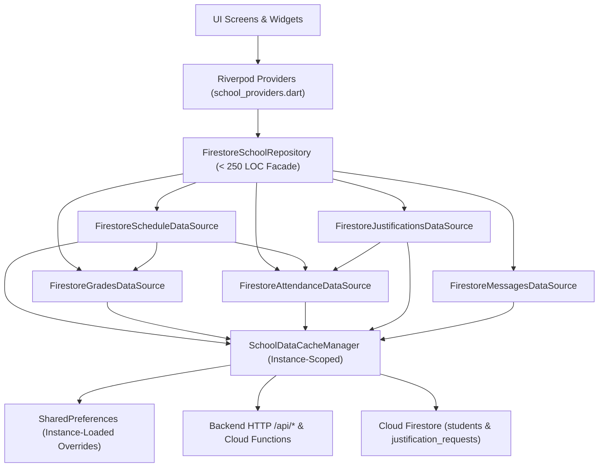

# Phase 24: Dekompozycja monolitycznego FirestoreSchoolRepository (2 691 LOC) na serwisy domenowe i izolacja warstwy cache - Research

**Researched:** 2026-10-03
**Domain:** Flutter / Dart Repository Layer Architecture, Domain DataSources Decomposition & Instance-Scoped Cache Management
**Confidence:** HIGH

<phase_requirements>
## Phase Requirements

| ID | Description | Research Support |
|----|-------------|------------------|
| `REQ-ARCH-03` | Dekompozycja monolitycznego `FirestoreSchoolRepository` (2 691 LOC) na wyspecjalizowane serwisy domenowe w `lib/data/repositories/firestore/` (`SchoolDataCacheManager`, `FirestoreGradesDataSource`, `FirestoreAttendanceDataSource`, `FirestoreJustificationsDataSource`, `FirestoreMessagesDataSource`, `FirestoreScheduleDataSource`) za fasadą `SchoolRepository` (< 250 LOC). | Complete line-by-line decomposition map (lines 1–2691) into 6 cohesive classes in `lib/data/repositories/firestore/` behind a ~195 LOC `FirestoreSchoolRepository` facade implementing all 30 `SchoolRepository` methods. |
| `REQ-ARCH-04` | Eliminacja globalnych pól `static final Map<...>` w warstwie repozytorium na rzecz instancyjnego `SchoolDataCacheManager` z czystą izolacją stanu pomiędzy użytkownikami i testami jednostkowymi. | Replaces all 5 `static` override fields (`_localReadOverrides`, `_readOverridesLoaded`, `_localJustificationOverrides`, `_justificationOverridesLoaded`, `_localDriveAttachmentsOverrides`) and top-level `UniqueKey._c` with instance-scoped fields inside `SchoolDataCacheManager`. |
</phase_requirements>

## Summary

`lib/data/repositories/firestore_school_repository.dart` is currently a 2,691-line monolithic class (`[VERIFIED: lib/data/repositories/firestore_school_repository.dart:20-2683]` — `class FirestoreSchoolRepository implements SchoolRepository {`) that combines HTTP/Firestore student document resolution, in-memory TTL caching, `SharedPreferences` override persistence, grades and GPA parsing, attendance and timetable slot cross-enrichment, student-parent justification workflows, message/attachment parsing, Google Drive folder management, and weekly schedule/substitution/exam resolution in a single file. Furthermore, it stores local user overrides in 5 `static` class variables (`[VERIFIED: lib/data/repositories/firestore_school_repository.dart:29-33]` — `static final Map<String, bool> _localReadOverrides = {};`, `static bool _readOverridesLoaded = false;`, `static final Map<String, String> _localJustificationOverrides = {};`, `static bool _justificationOverridesLoaded = false;`, `static final Map<String, Map<String, DriveAttachmentInfo>> _localDriveAttachmentsOverrides = {};`), causing state leakage across repository instances, user sessions, and unit tests.

Because `schoolRepositoryProvider` in `lib/presentation/providers/school_providers.dart` exposes `FirestoreSchoolRepository` as a singleton per `ProviderContainer` (`[VERIFIED: lib/presentation/providers/school_providers.dart:13-15]` — `final schoolRepositoryProvider = Provider<SchoolRepository>((ref) { return FirestoreSchoolRepository(); });`), moving all cache and override maps into an instance-scoped `SchoolDataCacheManager` shared by the 5 domain `*DataSource` instances inside `FirestoreSchoolRepository` preserves 100% of in-app shared state behavior while guaranteeing complete state isolation across repository instances and unit tests.

**Primary recommendation:** Extract `SchoolDataCacheManager` and the 5 domain `*DataSource` classes (`FirestoreGradesDataSource`, `FirestoreAttendanceDataSource`, `FirestoreJustificationsDataSource`, `FirestoreMessagesDataSource`, `FirestoreScheduleDataSource`) into `lib/data/repositories/firestore/` arranged as a strict 4-level Directed Acyclic Graph (DAG), and reduce `FirestoreSchoolRepository` to a `< 250 LOC` delegating facade that preserves its constructor signature and static `parseMessageDate` forwarder.

---

## Architectural Responsibility Map

| Capability | Primary Tier | Secondary Tier | Rationale |
|------------|-------------|----------------|-----------|
| `SchoolRepository` Contract & Facade (`FirestoreSchoolRepository`) | Data Repository Facade (`lib/data/repositories/`) | Riverpod Provider Tier (`schoolRepositoryProvider`) | Keeps all 30 public methods of `SchoolRepository` intact so zero Riverpod providers or UI widgets change their imports or calls. |
| Student Document Resolution, In-Memory TTL Cache & Local Overrides (`SchoolDataCacheManager`) | Data Cache Layer (`lib/data/repositories/firestore/`) | Local Storage (`SharedPreferences`) / Backend API (`/api/studentData`) / Firestore (`students/{id}`) | Centralizes the 2-minute `_memoryCache`, `targetLogin` resolution, and instance-scoped `SharedPreferences` overrides (`edusync_read_messages_overrides`, `edusync_justifications_overrides`, Drive attachment overrides). |
| Subjects, Grades & Recent Grades Parsing (`FirestoreGradesDataSource`) | Domain DataSource (`lib/data/repositories/firestore/`) | Data Cache Layer (`SchoolDataCacheManager`) | Isolates subject filtering, timetable teacher fallback lookup, grade percentage estimation, and tooltip `Komentarz:` extraction. |
| Attendance Records, Timetable Slot Enrichment & Librus e-Usprawiedliwienia (`FirestoreAttendanceDataSource`) | Domain DataSource (`lib/data/repositories/firestore/`) | Data Cache Layer (`SchoolDataCacheManager`) / Backend API (`/api/submitJustification`) | Owns attendance record parsing, timetable teacher/room lookup, attendance stats, submitting/cancelling justifications, and Firestore auto-correlation with `justification_requests`. |
| Student-Parent Justification Workflow & PIN Approval (`FirestoreJustificationsDataSource`) | Domain DataSource (`lib/data/repositories/firestore/`) | `FirestoreAttendanceDataSource` / Firestore (`justification_requests`) | Owns student request creation, Firestore query & unexcused-attendance reconciliation, full/partial PIN approval (`selectedRecordIds`), parent rejection, and student Q&A response. |
| Messages, Read State, Details & Google Drive Attachments (`FirestoreMessagesDataSource`) | Domain DataSource (`lib/data/repositories/firestore/`) | Data Cache Layer (`SchoolDataCacheManager`) / Backend Drive & Message APIs | Owns message thread parsing, sender/role/signature extraction, `parseMessageDate`, message details, read/unread sync to Firestore, and all 6 Google Drive attachment/folder methods. |
| Timetable, Substitutions, Exams, Profile, Teachers & Announcements (`FirestoreScheduleDataSource`) | Domain DataSource (`lib/data/repositories/firestore/`) | `FirestoreAttendanceDataSource` & `FirestoreGradesDataSource` | Owns `getStudentProfile`, `getUpcomingExam`, `getTodaySchedule`, `getScheduleForDay`, `getWeekSchedule`, `getAnnouncements`, and `getTeachers`. |

---

## Standard Stack

### Core
| Library | Version | Purpose | Why Standard |
|---------|---------|---------|--------------|
| `flutter_riverpod` | `^3.3.2` | Dependency injection via `schoolRepositoryProvider` | Already powers all repository consumers (`[VERIFIED: pubspec.yaml:40]` — `flutter_riverpod: ^3.3.2`). |
| `cloud_firestore` | `^6.10.0` | Firestore document/collection access (`students`, `justification_requests`) | Existing persistence SDK (`[VERIFIED: pubspec.yaml:45]` — `cloud_firestore: ^6.10.0`). |
| `shared_preferences` | `^2.5.5` | Local override persistence (`edusync_read_messages_overrides`, `edusync_justifications_overrides`, Drive default folder) | Existing local key-value store with built-in `SharedPreferences.setMockInitialValues` for unit tests (`[VERIFIED: pubspec.yaml:41]` — `shared_preferences: ^2.5.5`). |
| `http` | `^1.6.0` | Cloud Functions / `/api/*` HTTP calls + `package:http/testing.dart` (`MockClient`) for unit testing | Existing HTTP client (`[VERIFIED: pubspec.yaml:39]` — `http: ^1.6.0`). |
| `flutter_test` | `sdk: flutter` | Unit and widget test runner | Standard Flutter test framework (`[VERIFIED: pubspec.yaml:52-53]` — `flutter_test: sdk: flutter`). |

**Installation:**
No new packages are required. Step 2.6: SKIPPED (no external dependencies identified; 100% in-repo Dart refactoring and unit testing).

---

## External Caller & Static Reference Audit

A full codebase search (`grep_search` across `lib/` and `test/`) confirmed that `FirestoreSchoolRepository` is referenced in **only 2 files outside itself**:

1. **`lib/presentation/providers/school_providers.dart` (lines 3, 13–15)** `[VERIFIED: lib/presentation/providers/school_providers.dart:3-15]`:
   ```dart
   import '../../data/repositories/firestore_school_repository.dart';
   ...
   final schoolRepositoryProvider = Provider<SchoolRepository>((ref) {
     return FirestoreSchoolRepository();
   });
   ```
2. **`test/presentation/screens/messages_timestamp_test.dart` (lines 6, 61–107)** `[VERIFIED: test/presentation/screens/messages_timestamp_test.dart:61-101]`:
   ```dart
   group('FirestoreSchoolRepository.parseMessageDate', () {
     test('parses standard Librus SQL/ISO datetime string', () {
       final dt = FirestoreSchoolRepository.parseMessageDate('2026-09-28 09:54:12');
   ...
     test('parses serialized Firestore timestamp map with _seconds', () {
       final dt = FirestoreSchoolRepository.parseMessageDate({'_seconds': 1790589252});
   ```

**Critical compatibility requirement:**
`FirestoreSchoolRepository` MUST retain the static forwarder:
```dart
static DateTime parseMessageDate(dynamic raw, {DateTime? fallback}) =>
    FirestoreMessagesDataSource.parseMessageDate(raw, fallback: fallback);
```
so `test/presentation/screens/messages_timestamp_test.dart` continues to compile and pass without any modifications.

---

## Complete Line-by-Line Decomposition Map (1–2691 LOC)

Every line of `lib/data/repositories/firestore_school_repository.dart` (`[VERIFIED: lib/data/repositories/firestore_school_repository.dart:1-2691]`) and all 30 methods of `SchoolRepository` (`[VERIFIED: lib/data/repositories/school_repository.dart:10-72]`) are mapped below to their exact target class in `lib/data/repositories/firestore/`.

### 1. `SchoolDataCacheManager` (`lib/data/repositories/firestore/school_data_cache_manager.dart`)

| Source Lines in `firestore_school_repository.dart` | Original Symbol / Block | Target Member in `SchoolDataCacheManager` | Transformation Notes |
|----------------------------------------------------|-------------------------|-------------------------------------------|----------------------|
| `25–27` | `_memoryCache`, `_lastCacheTime`, `_cachedTargetLogin` | Instance fields `_memoryCache`, `_lastCacheTime`, `_cachedTargetLogin` + `memoryCache` getter + `seedMemoryCache(...)` + `invalidateMemoryCache()` | Instance-scoped 2-minute TTL cache. |
| `29–33` | `static final Map<String, bool> _localReadOverrides = {};`<br>`static bool _readOverridesLoaded = false;`<br>`static final Map<String, String> _localJustificationOverrides = {};`<br>`static bool _justificationOverridesLoaded = false;`<br>`static final Map<String, Map<String, DriveAttachmentInfo>> _localDriveAttachmentsOverrides = {};` | Instance fields:<br>`final Map<String, bool> _localReadOverrides = {};`<br>`bool _readOverridesLoaded = false;`<br>`final Map<String, String> _localJustificationOverrides = {};`<br>`bool _justificationOverridesLoaded = false;`<br>`final Map<String, Map<String, DriveAttachmentInfo>> _localDriveAttachmentsOverrides = {};` | **Eliminates all `static` mutable maps (`REQ-ARCH-04`).** |
| `35–51` | `_parseDriveAttachments(dynamic raw, String msgId)` | `Map<String, DriveAttachmentInfo> parseDriveAttachments(dynamic raw, String msgId)` | Parses raw map and merges `_localDriveAttachmentsOverrides[msgId]`. |
| `54–74` | `_loadReadOverrides()`, `_saveReadOverrides()` | `Future<void> ensureReadOverridesLoaded()`, `bool? getReadOverride(String msgId)`, `Future<void> setReadOverride(String msgId, bool isRead)`, `Future<void> setAllReadOverrides(Iterable<String> msgIds)` | Also updates `_memoryCache!['messages']` `isRead` flag in-place (lines `2195–2202`, `2238–2243`). |
| `76–96` | `_loadJustificationOverrides()`, `_saveJustificationOverrides()` | `Future<void> ensureJustificationOverridesLoaded()`, `String? getJustificationOverride(String id)`, `Future<void> setJustificationOverrides(Iterable<String> recordIds, String reason, {Iterable<String> removeRecordIds = const []})`, `Future<void> removeJustificationOverrides(Iterable<String> recordIds)` | Persists to `SharedPreferences` key `'edusync_justifications_overrides'`. |
| `105–113` | `_getTargetStudentDocLogin()` | `Future<String?> getTargetStudentDocLogin()` | Resolves `primaryLogin` via `LibrusConnectionService.resolvePrimaryLogin`. |
| `115–270` | `_getStudentData()` | `Future<Map<String, dynamic>?> getStudentData()` | Resolves demo mode, checks 2-min `_memoryCache`, tries `/api/studentData`, Cloud Function `getStudentData`, Firestore `students` candidate IDs, cached fallback, and offline Oskar profile fallback. Uses injectable `http.Client` and lazy `FirebaseFirestore`. |
| `307–327` | `static DateTime? _parseSyncTime(dynamic raw)` | `static DateTime? parseSyncTime(dynamic raw)` | Parses `Timestamp`, `DateTime`, ISO `String`, epoch `num`, or `{_seconds}` `Map` to local `DateTime`. |
| `1637–1648` | `_resolveStudentFullName()` | `Future<String> resolveStudentFullName()` | Reads student name from `getStudentData()` (`student['name']`), ignoring `'Uczeń'` and `'bartosz'`, defaulting to `'Oskar Jankiewicz'`. |
| `2155–2173` | In-memory cache update inside `getMessageDetails` | `void updateCachedMessageDetails({required String msgId, required String body, required List<String> attachments, required List<dynamic> rawFiles, required Map<String, DriveAttachmentInfo> driveAttachments})` | Encapsulates mutation of `_memoryCache!['messages']`. |
| `2263–2289` | `_prefDefaultDriveFolderId`, `_prefDefaultDriveFolderName`, `_updateCachedMessageDriveAttachment(...)` | `static const String prefDefaultDriveFolderId`, `static const String prefDefaultDriveFolderName`, `void updateCachedMessageDriveAttachment(String msgId, String attachmentName, DriveAttachmentInfo info)`, `void setCachedDefaultDriveFolder(String id, String name)` | Encapsulates Drive attachment & default folder cache updates. |
| `2686–2690` | `class UniqueKey` | `String generateUniqueId()` (instance method using instance counter `_idCounter++`) | Removes top-level `class UniqueKey` and its `static int _c = 0;`. |

---

### 2. `FirestoreGradesDataSource` (`lib/data/repositories/firestore/firestore_grades_data_source.dart`)

| Source Lines in `firestore_school_repository.dart` | `SchoolRepository` / Helper Method | Responsibilities |
|----------------------------------------------------|------------------------------------|------------------|
| `806–929` | `Future<List<Subject>> getSubjects()` | Fetches `cacheManager.getStudentData()` (or `mockFallback.getSubjects()`), filters invalid subject names (`kategoria`, `brak ocen`, `ocena opisowa`, `punkty startowe`, `suma`, `okres 1`, `okres 2`, `zachowanie`), builds teacher lookup map from `data['timetable']`, parses `Grade` items with percentage estimation and `Komentarz:` extraction, returns `List<Subject>`. |
| `931–942` | `Future<List<Grade>> getRecentGrades()` | Calls `getSubjects()`, flattens all `Subject.grades`, falls back to `mockFallback.getRecentGrades()` when `data == null && allGrades.isEmpty`, sorts descending by `date`. |

---

### 3. `FirestoreAttendanceDataSource` (`lib/data/repositories/firestore/firestore_attendance_data_source.dart`)

| Source Lines in `firestore_school_repository.dart` | `SchoolRepository` / Helper Method | Responsibilities |
|----------------------------------------------------|------------------------------------|------------------|
| `944–1213` | `Future<List<AttendanceRecord>> getAttendanceRecords()` | Calls `cacheManager.ensureJustificationOverridesLoaded()`, fetches `cacheManager.getStudentData()` (or maps `mockFallback.getAttendanceRecords()` with `cacheManager.getJustificationOverride`), enriches records with teacher/room/subject via `lookupTimetableSlot` (exact `dayOfWeek + lessonNumber`, fallback `dayOfWeek + subject`, fallback any day `subject`), cross-checks `data['justifications']`, applies local overrides, returns `List<AttendanceRecord>`. |
| `1215–1235` | `Future<Map<String, dynamic>> getAttendanceStats()` | Reads `data['attendanceStats']` (`presenceCount`, `absenceCount`, `lateCount`, `excusedCount`, `percentage`) with default fallback values. |
| `1502–1625` | `Future<void> submitJustification(List<String> recordIds, String reason, {DateTime? date})` | Updates `cacheManager.setJustificationOverrides`, builds `hoursByDate` from `getAttendanceRecords()`, posts to `/api/submitJustification` (with Cloud Function fallback), auto-correlates matching `pendingParentApproval` docs in Firestore `justification_requests`, and delegates to `mockFallback.submitJustification`. |
| `1627–1635` | `Future<void> cancelJustification(List<String> recordIds)` | Calls `cacheManager.removeJustificationOverrides(recordIds)` and delegates to `mockFallback.cancelJustification(recordIds)`. |

---

### 4. `FirestoreJustificationsDataSource` (`lib/data/repositories/firestore/firestore_justifications_data_source.dart`)

| Source Lines in `firestore_school_repository.dart` | `SchoolRepository` / Helper Method | Responsibilities |
|----------------------------------------------------|------------------------------------|------------------|
| `1650–1705` | `Future<void> requestJustification(List<String> recordIds, String reason, {DateTime? date})` | Resolves `appUser`, `cacheManager.resolveStudentFullName()`, and matching `AttendanceRecord`s from `attendanceDataSource.getAttendanceRecords()`, posts to `/api/createJustificationRequest` (with Cloud Function fallback), and delegates to `mockFallback.requestJustification`. |
| `1707–1795` | `Future<List<JustificationRequest>> getJustificationRequests()` | Queries Firestore `justification_requests` ordered by `requestedAt` descending (falling back to `mockFallback` only in demo mode and filtering out `req_init_01` in non-demo mode), reconciles `pendingParentApproval` requests against `attendanceDataSource.getAttendanceRecords()`, and auto-marks reconciled requests `approved` in Firestore. |
| `1797–1911` | `Future<bool> approveJustificationRequest(String requestId, String pin, {List<String>? selectedRecordIds})` | Resolves `targetReq` and `attendanceDataSource.getAttendanceRecords()`, computes `effectiveRecordIds`, `hoursByDate`, `selectedLessonNumbers`, `dateFrom`, `dateTo`, posts `action: 'approve'` to `/api/reviewJustificationRequest` (with Cloud Function fallback), updates `cacheManager` justification overrides (adding `effectiveRecordIds` and removing deselected `targetReq.recordIds`), and calls `mockFallback.approveJustificationRequest`. |
| `1913–1947` | `Future<bool> rejectJustificationRequest(String requestId, {String? reason})` | Posts `action: 'reject'` to `/api/reviewJustificationRequest` (with Cloud Function fallback) and calls `mockFallback.rejectJustificationRequest`. |
| `1949–1984` | `Future<bool> respondJustificationRequest(String requestId, {required String responseText})` | Posts student response to `/api/respondJustificationRequest` (with Cloud Function fallback) and calls `mockFallback.respondJustificationRequest`. |

---

### 5. `FirestoreMessagesDataSource` (`lib/data/repositories/firestore/firestore_messages_data_source.dart`)

| Source Lines in `firestore_school_repository.dart` | `SchoolRepository` / Helper Method | Responsibilities |
|----------------------------------------------------|------------------------------------|------------------|
| `1237–1404` | `Future<List<MessageThread>> getMessages()` | Calls `cacheManager.ensureReadOverridesLoaded()`, reads `data['messages']` (or maps `mockFallback.getMessages()` with read overrides), extracts sender role/cleanName/signature/initials, parses date via `parseMessageDate`, determines `isUnread`, extracts `attachmentFiles`/`attachments` and `cacheManager.parseDriveAttachments`, returns `List<MessageThread>`. |
| `1406–1472` | `static DateTime parseMessageDate(dynamic raw, {DateTime? fallback})` | Resilient parser for `Timestamp`, `DateTime`, epoch `num`, `{_seconds}` `Map`, `.toDate()` objects, ISO/SQL strings, `DD.MM.YYYY HH:MM`, and embedded ISO dates. |
| `2079–2107` | `Future<void> sendMessage({required List<String> recipientNames, required String subject, required String body, String? replyToId})` | Posts to `/api/sendMessage` (5s timeout) and calls `mockFallback.sendMessage`. |
| `2109–2113` | `Future<String?> getMessageBody(String msgId, {String? url})` | Delegates to `getMessageDetails(msgId, url: url)` and returns `details?.body`. |
| `2115–2186` | `Future<MessageDetailsResult?> getMessageDetails(String msgId, {String? url})` | Fetches `/api/messageDetails`, parses `body`, `attachmentFiles`, `attachments`, `driveAttachments`, updates cache via `cacheManager.updateCachedMessageDetails(...)`, returns `MessageDetailsResult`. |
| `2188–2227` | `Future<void> markMessageAsRead(String msgId, {bool isRead = true})` | Calls `cacheManager.setReadOverride(msgId, isRead)`, `mockFallback.markMessageAsRead`, and updates `students/{targetLogin}` `messages` array in Firestore. |
| `2229–2261` | `Future<void> markAllMessagesAsRead()` | Fetches `getMessages()`, calls `cacheManager.setAllReadOverrides(...)`, `mockFallback.markAllMessagesAsRead()`, and marks all `messages` read in Firestore `students/{targetLogin}`. |
| `2291–2352` | `Future<DriveFolderOption> getDefaultDriveFolder()` | Resolves default Drive folder from demo fallback, `cacheManager` memory cache, Firestore `students/{targetLogin}`, `SharedPreferences`, or `DriveFolderOption.rootFolder`. |
| `2354–2389` | `Future<void> setDefaultDriveFolder(DriveFolderOption folder)` | Normalizes folder ID/name, saves to `SharedPreferences`, updates `cacheManager.setCachedDefaultDriveFolder`, and persists to Firestore `students/{targetLogin}`. |
| `2391–2473` | `Future<DriveAttachmentInfo> saveAttachmentToDrive({...})` | Resolves default folder and `effectiveSavedBy`, posts to `/api/saveAttachmentToDrive` (with Cloud Function fallback), handles `401`/`403` `UNAUTHENTICATED_DRIVE`, updates `cacheManager.updateCachedMessageDriveAttachment`, returns `DriveAttachmentInfo`. |
| `2475–2523` | `Future<List<DriveFolderOption>> listDriveFolders({required String accessToken})` | Posts `action: 'list'` to `/api/driveFolder?action=list` (with Cloud Function fallback), parses `DriveFolderOption` list excluding `'root'`. |
| `2525–2586` | `Future<DriveFolderOption> createDriveFolder({required String accessToken, required String folderName, bool setAsDefault = false})` | Posts `action: 'create'` to `/api/driveFolder?action=create` (with Cloud Function fallback), optionally calls `setDefaultDriveFolder(created)`. |
| `2588–2682` | `Future<void> moveDriveAttachment({...})` | Posts `action: 'move'` to `/api/driveFolder?action=move` (with Cloud Function fallback), updates `cacheManager.updateCachedMessageDriveAttachment` for moved attachments, and optionally calls `setDefaultDriveFolder`. |

---

### 6. `FirestoreScheduleDataSource` (`lib/data/repositories/firestore/firestore_schedule_data_source.dart`)

| Source Lines in `firestore_school_repository.dart` | `SchoolRepository` / Helper Method | Responsibilities |
|----------------------------------------------------|------------------------------------|------------------|
| `272–305` | `Future<StudentProfile> getStudentProfile()` | Reads `cacheManager.getStudentData()` (or `mockFallback.getStudentProfile()`), maps `student`, `luckyNumber`, `overallAverage`, `attendanceStats`, `unreadMessagesCount`, and `SchoolDataCacheManager.parseSyncTime(...)` into `StudentProfile`. |
| `329–402` | `String cleanEventSubjectName(Map<String, dynamic> event, List<dynamic> timetable)` | Cleans polluted exam/event subject names using known timetable subjects, comma-separated `rawText` segments, and teacher matching. |
| `404–440` | `Future<UpcomingEvent?> getUpcomingExam()` | Reads `data['upcomingExam']` (or `mockFallback.getUpcomingExam()`), cleans subject via `cleanEventSubjectName`, computes `daysRemaining`, returns `UpcomingEvent`. |
| `442–450` | `static DateTime normalizeToMonday(DateTime dt)`, `static bool isWarsawTripWeek(DateTime date)` | Normalizes any date to its week's Monday and checks if the week is `2026-09-14` (Warsaw school trip week). |
| `452–486` | `List<Map<String, dynamic>> extractAllEvents(Map<String, dynamic> data)` | Extracts and deduplicates calendar events from `data['events']`, `data['upcomingExams']`, and `data['upcomingExam']`. |
| `488–699` | `List<LessonSlot> parseTimetableForDay(...)` | Parses lessons for `targetDay`, strips non-trip cancellation/substitution prefixes, handles `Melska Grażyna` / `Czajkowska Maria` substitution, enriches with `dayEvents` from Terminarz, and overlays `dayAttendance` records. |
| `701–734` | `Future<List<LessonSlot>> getTodaySchedule()` | Returns `[]` on weekends; otherwise fetches `cacheManager.getStudentData()`, `extractAllEvents`, and `attendanceDataSource.getAttendanceRecords()`, and delegates to `parseTimetableForDay`. |
| `736–769` | `Future<List<LessonSlot>> getScheduleForDay(int dayOfWeek)` | Returns `[]` for `dayOfWeek > 5`; otherwise resolves `targetDate` in current week, fetches attendance and events, and delegates to `parseTimetableForDay`. |
| `771–804` | `Future<Map<int, List<LessonSlot>>> getWeekSchedule({DateTime? weekStart})` | Builds Monday-to-Friday `Map<int, List<LessonSlot>>` for `weekStart`, enriching each day with `extractAllEvents` and `attendanceDataSource.getAttendanceRecords()`. |
| `1474–1500` | `Future<List<Announcement>> getAnnouncements()` | Reads `data['announcements']` (or `mockFallback.getAnnouncements()`), parses `publishedDate` via `FirestoreMessagesDataSource.parseMessageDate(a['date'])`, returns `List<Announcement>`. |
| `1986–2077` | `Future<List<TeacherContact>> getTeachers()` | Aggregates unique `TeacherContact` items from: (1) educator in `data['student']`, (2) `data['timetable']`, (3) `gradesDataSource.getSubjects()`, and (4) `data['attendance']`. |

---

### 7. `FirestoreSchoolRepository` Facade (`lib/data/repositories/firestore_school_repository.dart`)

After extracting the 6 classes above, `lib/data/repositories/firestore_school_repository.dart` contains **only**:
- Constructor wiring `SchoolDataCacheManager` and the 5 `*DataSource` instances (all injectable for testing).
- `static DateTime parseMessageDate(dynamic raw, {DateTime? fallback}) => FirestoreMessagesDataSource.parseMessageDate(raw, fallback: fallback);`
- 30 one-line `@override` methods delegating to `_scheduleDataSource`, `_gradesDataSource`, `_attendanceDataSource`, `_justificationsDataSource`, and `_messagesDataSource`.
- **Total size:** ~195 LOC (`< 250 LOC` target met with >50 LOC margin).

---

## Architecture Patterns

### System Architecture Diagram



### Recommended Project Structure

```
lib/data/repositories/
├── school_repository.dart                              # Unchanged 30-method abstract interface (74 LOC)
├── mock_school_repository.dart                         # Unchanged demo/mock fallback (637 LOC)
├── firestore_school_repository.dart                    # Pure delegating facade (< 250 LOC)
└── firestore/
    ├── school_data_cache_manager.dart                  # Shared student doc cache & instance-scoped overrides (~290 LOC)
    ├── firestore_grades_data_source.dart               # Subjects, grades & recent grades (~155 LOC)
    ├── firestore_attendance_data_source.dart           # Attendance records, stats, submit & cancel justification (~430 LOC)
    ├── firestore_justifications_data_source.dart       # Student requests, PIN approve/reject/respond (~360 LOC)
    ├── firestore_messages_data_source.dart             # Messages, read state, details & Google Drive (~680 LOC)
    └── firestore_schedule_data_source.dart             # Profile, exams, timetable, teachers & announcements (~640 LOC)
```

### Pattern 1: Lazy `FirebaseFirestore` Resolution & Injectable `http.Client` for Unit Testability
**What:** Never evaluate `FirebaseFirestore.instance` eagerly in constructor initializer lists when `firestore == null`. Store `final FirebaseFirestore? _firestoreOverride;` and resolve `FirebaseFirestore get _firestore => _firestoreOverride ?? FirebaseFirestore.instance;` lazily only when a Firestore SDK path is actually reached. Similarly, accept `http.Client? httpClient` (defaulting to `http.Client()`).
**When to use:** In `SchoolDataCacheManager`, `FirestoreAttendanceDataSource`, `FirestoreJustificationsDataSource`, `FirestoreMessagesDataSource`, and `FirestoreSchoolRepository`.
**Why:** In Flutter unit tests (`flutter test`), `Firebase.initializeApp()` is not called. Eagerly evaluating `FirebaseFirestore.instance` in a constructor throws `[core/no-app] No Firebase App '[DEFAULT]' has been created` before any test can even run! Lazy resolution + `http.Client` injection + `SchoolDataCacheManager.seedMemoryCache(...)` allows 100% pure Dart unit testing without requiring Firebase native/web initialization.

**Example:**
```dart
class SchoolDataCacheManager {
  final FirebaseFirestore? _firestoreOverride;
  final LibrusConnectionService _connectionService;
  final http.Client _httpClient;
  final Duration cacheTtl;

  FirebaseFirestore get firestore =>
      _firestoreOverride ?? FirebaseFirestore.instance;

  SchoolDataCacheManager({
    FirebaseFirestore? firestore,
    LibrusConnectionService? connectionService,
    http.Client? httpClient,
    this.cacheTtl = const Duration(minutes: 2),
  })  : _firestoreOverride = firestore,
        _connectionService = connectionService ?? LibrusConnectionService(),
        _httpClient = httpClient ?? http.Client();
}
```

### Pattern 2: Facade Constructor Preserving Backward Compatibility + Full DI
**What:** `FirestoreSchoolRepository` keeps its exact existing named parameters (`firestore`, `connectionService`) while adding optional named parameters for `mockFallback`, `httpClient`, `cacheManager`, and the 5 `*DataSource` classes.
**Example:**
```dart
class FirestoreSchoolRepository implements SchoolRepository {
  final SchoolDataCacheManager cacheManager;
  final FirestoreGradesDataSource gradesDataSource;
  final FirestoreAttendanceDataSource attendanceDataSource;
  final FirestoreJustificationsDataSource justificationsDataSource;
  final FirestoreMessagesDataSource messagesDataSource;
  final FirestoreScheduleDataSource scheduleDataSource;

  FirestoreSchoolRepository({
    FirebaseFirestore? firestore,
    LibrusConnectionService? connectionService,
    MockSchoolRepository? mockFallback,
    http.Client? httpClient,
    SchoolDataCacheManager? cacheManager,
    FirestoreGradesDataSource? gradesDataSource,
    FirestoreAttendanceDataSource? attendanceDataSource,
    FirestoreJustificationsDataSource? justificationsDataSource,
    FirestoreMessagesDataSource? messagesDataSource,
    FirestoreScheduleDataSource? scheduleDataSource,
  }) : this._init(
          firestore: firestore,
          connectionService: connectionService ?? LibrusConnectionService(),
          mockFallback: mockFallback ?? MockSchoolRepository(),
          httpClient: httpClient ?? http.Client(),
          cacheManager: cacheManager,
          gradesDataSource: gradesDataSource,
          attendanceDataSource: attendanceDataSource,
          justificationsDataSource: justificationsDataSource,
          messagesDataSource: messagesDataSource,
          scheduleDataSource: scheduleDataSource,
        );
```

### Anti-Patterns to Avoid
- **Keeping any `static` mutable maps or counters in `FirestoreSchoolRepository` or `SchoolDataCacheManager`:** Directly violates `REQ-ARCH-04` and causes cross-test pollution when `SharedPreferences.setMockInitialValues({})` is reset between tests (`_readOverridesLoaded` would stay `true` if static!).
- **Cyclic imports between `*DataSource` classes:** Never pass `FirestoreSchoolRepository` into a `*DataSource`. Follow the strict DAG (`FirestoreJustificationsDataSource` -> `FirestoreAttendanceDataSource`, and `FirestoreScheduleDataSource` -> `FirestoreAttendanceDataSource` + `FirestoreGradesDataSource`).
- **Removing `FirestoreSchoolRepository.parseMessageDate`:** Breaks `test/presentation/screens/messages_timestamp_test.dart:63-100`. Keep it as a 2-line static forwarder to `FirestoreMessagesDataSource.parseMessageDate`.

---

## Don't Hand-Roll

| Problem | Don't Build | Use Instead | Why |
|---------|-------------|-------------|-----|
| Mocking HTTP requests in unit tests | Custom socket servers or global HTTP overrides | `MockClient` from `package:http/testing.dart` | Already included in `http: ^1.6.0` (`pubspec.yaml:39`); deterministic, zero network I/O. |
| Mocking `SharedPreferences` in unit tests | Custom file-backed storage | `SharedPreferences.setMockInitialValues({...})` | Built into `shared_preferences: ^2.5.5`; resets cleanly in `setUp()`. |
| Custom event/bus for cross-datasource cache updates | Stream buses between datasources | Shared `SchoolDataCacheManager` instance | All 5 `*DataSource` instances in a `FirestoreSchoolRepository` hold a reference to the same `SchoolDataCacheManager` instance, so mutations to `_memoryCache` or overrides are immediately visible across all domain datasources. |

**Key insight:** Because `SchoolDataCacheManager` is injected as a shared instance into all 5 `*DataSource` objects owned by a `FirestoreSchoolRepository`, in-memory mutations (like `markMessageAsRead` or `saveAttachmentToDrive` updating `_memoryCache!['messages']`) remain immediately visible to `getMessages()` without any global `static` variables.

---

## Runtime State Inventory

| Category | Items Found | Action Required |
|----------|-------------|------------------|
| Stored data | Firestore collections `students` and `justification_requests`; `SharedPreferences` keys `'edusync_read_messages_overrides'` (`[VERIFIED: lib/data/repositories/firestore_school_repository.dart:58]`), `'edusync_justifications_overrides'` (`[VERIFIED: lib/data/repositories/firestore_school_repository.dart:80]`), `'edusync_drive_default_folder_id'` (`[VERIFIED: lib/data/repositories/firestore_school_repository.dart:2263]`), `'edusync_drive_default_folder_name'` (`[VERIFIED: lib/data/repositories/firestore_school_repository.dart:2264]`). | Code edit only — preserve exact `SharedPreferences` key strings and Firestore collection/field names inside `SchoolDataCacheManager` and `*DataSource` classes. No data migration needed. |
| Live service config | Cloud Functions endpoints `/api/studentData`, `/api/submitJustification`, `/api/createJustificationRequest`, `/api/reviewJustificationRequest`, `/api/respondJustificationRequest`, `/api/sendMessage`, `/api/messageDetails`, `/api/saveAttachmentToDrive`, `/api/driveFolder` and their `cloudfunctions.net` fallbacks. | None — all endpoint URLs and JSON payloads remain byte-identical. |
| OS-registered state | None — verified by codebase grep across `lib/`, `web/`, and `functions/`. | None. |
| Secrets/env vars | None — repository layer uses no environment variables or secret keys. | None. |
| Build artifacts | None — pure Dart source files in `lib/data/repositories/`. | Run `flutter analyze` and `flutter test` after extraction. |

---

## Common Pitfalls

### Pitfall 1: Static `_readOverridesLoaded` / `_justificationOverridesLoaded` Bug in Tests
**What goes wrong:** Previously, because `_readOverridesLoaded` and `_justificationOverridesLoaded` were `static bool` fields on `FirestoreSchoolRepository`, once any test loaded `SharedPreferences`, subsequent tests that called `SharedPreferences.setMockInitialValues(...)` never reloaded from `SharedPreferences` and saw stale overrides from earlier tests.
**Why it happens:** Static booleans live for the entire Dart VM process lifetime.
**How to avoid:** Make `_readOverridesLoaded`, `_justificationOverridesLoaded`, `_localReadOverrides`, `_localJustificationOverrides`, and `_localDriveAttachmentsOverrides` **instance fields** on `SchoolDataCacheManager`. Each new `SchoolDataCacheManager()` or `FirestoreSchoolRepository()` starts with clean state and loads fresh values from `SharedPreferences`.
**Warning signs:** Unit tests passing individually (`flutter test path/to/test.dart`) but failing when run together (`flutter test`).

### Pitfall 2: Eager `FirebaseFirestore.instance` Crash in Unit Tests
**What goes wrong:** Constructing `FirestoreSchoolRepository()` or `SchoolDataCacheManager()` in a unit test throws `[core/no-app] No Firebase App '[DEFAULT]' has been created - call Firebase.initializeApp()`.
**Why it happens:** `_firestore = firestore ?? FirebaseFirestore.instance` in a constructor initializer list calls `FirebaseFirestore.instance` immediately at object construction time, even if the test only exercises cached data, HTTP `MockClient`, or `MockSchoolRepository`.
**How to avoid:** Store `final FirebaseFirestore? _firestore;` and access `FirebaseFirestore get firestore => _firestore ?? FirebaseFirestore.instance;` lazily only inside methods that query Firestore directly.
**Warning signs:** `core/no-app` exception in `setUp()` when instantiating `SchoolDataCacheManager` or `*DataSource`.

### Pitfall 3: Name Collision with Flutter's `UniqueKey`
**What goes wrong:** Lines `2686–2690` of `firestore_school_repository.dart` define a custom `class UniqueKey` (`[VERIFIED: lib/data/repositories/firestore_school_repository.dart:2686-2690]` — `class UniqueKey { static int _c = 0; @override String toString() => 'k_${DateTime.now().millisecondsSinceEpoch}_${_c++}'; }`), which collides with `UniqueKey` from `package:flutter/foundation.dart` if `foundation.dart` is imported without hiding or if someone uses `UniqueKey()`.
**How to avoid:** Replace `UniqueKey().toString()` in `SchoolDataCacheManager` and the `*DataSource` files with `cacheManager.generateUniqueId()` using an instance-scoped counter `int _idCounter = 0;` (`'k_${DateTime.now().millisecondsSinceEpoch}_${_idCounter++}'`).

---

## Recommended Wave 1 / Wave 2 Plan Breakdown

### Wave 1: `24-01-PLAN.md` — Extract `SchoolDataCacheManager` & Academic/Attendance/Justification DataSources + Unit Tests
1. **Task 1: Create `SchoolDataCacheManager` (`lib/data/repositories/firestore/school_data_cache_manager.dart`) and `FirestoreGradesDataSource` (`lib/data/repositories/firestore/firestore_grades_data_source.dart`)**
   - Implement `SchoolDataCacheManager` with instance-scoped `_memoryCache` (2-min TTL, `targetLogin` tracking, `seedMemoryCache`, `invalidateMemoryCache`), lazy `FirebaseFirestore`, injectable `http.Client`, and instance-scoped `SharedPreferences` overrides (`_localReadOverrides`, `_localJustificationOverrides`, `_localDriveAttachmentsOverrides`).
   - Implement `FirestoreGradesDataSource` (`getSubjects`, `getRecentGrades`).
2. **Task 2: Create `FirestoreAttendanceDataSource` (`lib/data/repositories/firestore/firestore_attendance_data_source.dart`) and `FirestoreJustificationsDataSource` (`lib/data/repositories/firestore/firestore_justifications_data_source.dart`) + Unit Tests (`test/data/repositories/firestore_cache_and_attendance_test.dart`)**
   - Implement `FirestoreAttendanceDataSource` (`getAttendanceRecords`, `getAttendanceStats`, `submitJustification`, `cancelJustification`).
   - Implement `FirestoreJustificationsDataSource` (`requestJustification`, `getJustificationRequests`, `approveJustificationRequest`, `rejectJustificationRequest`, `respondJustificationRequest`).
   - Write comprehensive unit tests in `test/data/repositories/firestore_cache_and_attendance_test.dart` verifying instance-scoped cache isolation between two `SchoolDataCacheManager` instances, TTL cache hits/invalidation, `FirestoreGradesDataSource` subject/grade parsing, `FirestoreAttendanceDataSource` timetable enrichment & override application, and `FirestoreJustificationsDataSource` full & partial (`selectedRecordIds`) PIN approval.

### Wave 2: `24-02-PLAN.md` — Extract `FirestoreMessagesDataSource` & `FirestoreScheduleDataSource`, Refactor `FirestoreSchoolRepository` Facade (< 250 LOC) + Unit Tests
1. **Task 1: Create `FirestoreMessagesDataSource` (`lib/data/repositories/firestore/firestore_messages_data_source.dart`) and `FirestoreScheduleDataSource` (`lib/data/repositories/firestore/firestore_schedule_data_source.dart`)**
   - Implement `FirestoreMessagesDataSource` (`getMessages`, `parseMessageDate`, `sendMessage`, `getMessageBody`, `getMessageDetails`, `markMessageAsRead`, `markAllMessagesAsRead`, `getDefaultDriveFolder`, `setDefaultDriveFolder`, `saveAttachmentToDrive`, `listDriveFolders`, `createDriveFolder`, `moveDriveAttachment`).
   - Implement `FirestoreScheduleDataSource` (`getStudentProfile`, `getUpcomingExam`, `getTodaySchedule`, `getScheduleForDay`, `getWeekSchedule`, `getAnnouncements`, `getTeachers`, plus timetable/event helpers).
2. **Task 2: Refactor `FirestoreSchoolRepository` (`lib/data/repositories/firestore_school_repository.dart`) to `< 250 LOC` Facade + Unit Tests (`test/data/repositories/firestore_messages_and_schedule_test.dart`)**
   - Replace the 2,691 LOC body of `lib/data/repositories/firestore_school_repository.dart` with the `< 250 LOC` facade delegating all 30 `SchoolRepository` methods to the 5 `*DataSource` classes and forwarding `FirestoreSchoolRepository.parseMessageDate` to `FirestoreMessagesDataSource.parseMessageDate`.
   - Write unit tests in `test/data/repositories/firestore_messages_and_schedule_test.dart` covering `FirestoreMessagesDataSource` (sender role/signature parsing, read overrides, Drive attachment state), `FirestoreScheduleDataSource` (Warsaw trip week vs normal week, Terminarz event matching, attendance overlay on `LessonSlot`, teacher aggregation), and `FirestoreSchoolRepository` facade delegation.
   - Verify `wc -l lib/data/repositories/firestore_school_repository.dart` is `< 250`, zero `static final Map` exists in `lib/data/repositories/`, and both `flutter analyze` and `flutter test` pass 100%.

---

## Validation Architecture

### Test Framework
| Property | Value |
|----------|-------|
| Framework | `flutter_test` (Flutter SDK, Dart `^3.10.4`) |
| Config file | `analysis_options.yaml` / `pubspec.yaml` |
| Quick run command | `flutter test test/data/repositories/ test/presentation/screens/messages_timestamp_test.dart` |
| Full suite command | `flutter test && flutter analyze` |

### Phase Requirements → Test Map
| Req ID | Behavior | Test Type | Automated Command | File Exists? |
|--------|----------|-----------|-------------------|-------------|
| `REQ-ARCH-03` | `FirestoreSchoolRepository` (`< 250 LOC`) delegates all 30 `SchoolRepository` methods to `SchoolDataCacheManager` and the 5 `*DataSource` classes in `lib/data/repositories/firestore/` with zero regressions in existing providers/screens | unit + widget | `flutter test test/data/repositories/ test/attendance_pending_requests_test.dart test/message_attachments_test.dart test/presentation/screens/messages_timestamp_test.dart` | ❌ Wave 1 & Wave 2 (`test/data/repositories/...`) |
| `REQ-ARCH-04` | Zero `static final Map<...>` in repository layer; two `SchoolDataCacheManager` / `FirestoreSchoolRepository` instances have completely isolated in-memory cache and local override maps | unit | `flutter test test/data/repositories/firestore_cache_and_attendance_test.dart` | ❌ Wave 1 |

### Sampling Rate
- **Per task commit:** `flutter analyze && flutter test test/data/repositories/`
- **Per wave merge:** `flutter analyze && flutter test`
- **Phase gate:** Full `flutter test` suite + `flutter analyze` green and `wc -l lib/data/repositories/firestore_school_repository.dart` < 250 before `/gsd-verify-work`.

### Wave 0 Gaps
- [ ] `test/data/repositories/firestore_cache_and_attendance_test.dart` — unit tests for `SchoolDataCacheManager`, `FirestoreGradesDataSource`, `FirestoreAttendanceDataSource`, and `FirestoreJustificationsDataSource` (created in Plan `24-01`).
- [ ] `test/data/repositories/firestore_messages_and_schedule_test.dart` — unit tests for `FirestoreMessagesDataSource`, `FirestoreScheduleDataSource`, and `FirestoreSchoolRepository` facade (created in Plan `24-02`).

---

## Security Domain

### Applicable ASVS Categories
| ASVS Category | Applies | Standard Control |
|---------------|---------|-----------------|
| V2 Authentication | no | Handled by `LibrusAuthService` / `FirebaseAuth`; unchanged by repository decomposition. |
| V3 Session Management | yes | Instance-scoped `SchoolDataCacheManager` eliminates cross-user static state leakage (`REQ-ARCH-04`) when switching accounts or roles (`student` vs `parent`). |
| V4 Access Control | yes | Preserves `LibrusConnectionService.resolvePrimaryLogin` and role parameters (`&role=student` vs `&role=parent`) in `SchoolDataCacheManager.getStudentData()`. |
| V5 Input Validation | yes | Preserves `Uri.encodeComponent(...)` on `targetLogin`, `resolvedPrimaryLogin`, and `url` query parameters in `SchoolDataCacheManager` and `FirestoreMessagesDataSource`. |
| V6 Cryptography | no | Not applicable to repository data source decomposition. |

### Known Threat Patterns for Flutter / Firestore Repository Layer
| Pattern | STRIDE | Standard Mitigation |
|---------|--------|---------------------|
| Cross-session / cross-user state pollution via `static final Map` | Information Disclosure / Tampering | Replace all `static final Map` fields with instance-scoped fields in `SchoolDataCacheManager` (`REQ-ARCH-04`). |
| Unencoded query parameters in `/api/*` requests | Injection / Tampering | Retain `Uri.encodeComponent` for all user-supplied / login parameters (`[VERIFIED: lib/data/repositories/firestore_school_repository.dart:139-140]`). |

---

## Assumptions Log

| # | Claim | Section | Risk if Wrong |
|---|-------|---------|---------------|
| — | None — all claims in this research were verified directly against the repository source files in this session. | — | — |

---

## Sources

### Primary (HIGH confidence)
- `lib/data/repositories/firestore_school_repository.dart` (lines 1–2691) — Full line-by-line inspection of all fields, static maps, private helpers, and 30 `@override` methods.
- `lib/data/repositories/school_repository.dart` (lines 1–74) — Abstract `SchoolRepository` contract (30 methods).
- `lib/presentation/providers/school_providers.dart` (lines 1–545) — Provider instantiation and consumption of `SchoolRepository`.
- `lib/data/repositories/mock_school_repository.dart` (lines 1–200) & `lib/data/services/librus_connection_service.dart` (lines 1–250) — Fallback repository and primaryLogin resolution semantics.
- `test/presentation/screens/messages_timestamp_test.dart` (lines 1–312) — External test caller of `FirestoreSchoolRepository.parseMessageDate`.

## Metadata

**Confidence breakdown:**
- Standard stack: HIGH — 100% existing in-repo packages (`pubspec.yaml`).
- Architecture: HIGH — Complete 1–2691 line mapping verified with acyclic dependency graph.
- Pitfalls: HIGH — Identified static override leakage, eager `FirebaseFirestore.instance` initialization in unit tests, and `parseMessageDate` test caller.

**Research date:** 2026-10-03
**Valid until:** 2026-11-03
